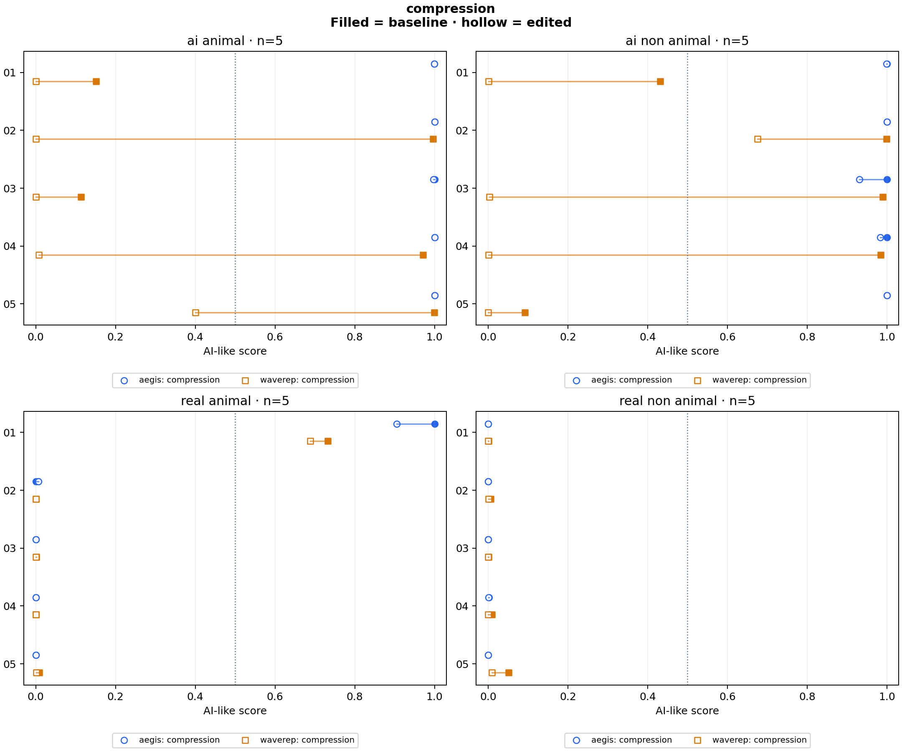

# Video Robustness

[](https://github.com/Adnan8104/video-robustness/actions/workflows/ci.yml)

Compares pretrained AI-video detectors on real and generated footage, including compression, resizing and cropping.
Two models: **AEGIS** and **WaveRep**. Runs on CPU; no training required.

## Key findings

- **Compression weakened WaveRep's AI signal.** On a 20-clip panel, generated clips below 0.5 rose from **4/10 to 9/10** after stronger compression.
- **The models responded differently under compression.** WaveRep scores changed by at least 0.10 on **9/10 generated clips**. AEGIS had **0/20** changes that large in the compression pair.
- **Failures started before the strongest compression.** On two selected AI clips, WaveRep crossed below 0.5 between CRF **23–28** (elephant) and **18–23** (sunset scene).
- **Edits can push real footage toward AI.** Half-size resize moved AEGIS’s real-elephant score **0.0005 → 0.839**. A separate [fixed-frame kitten check](reports/kitten-isolation/report.md) found crop-triggered AEGIS and resize-triggered WaveRep flips too.



Higher scores mean more AI-like. These are small-sample results; 0.5 is a reference point, not a validated detection threshold.
[All three edits](docs/panel-results.md) · [Intermediate compression check](reports/failure-followup/report.md)

A [separate 20-clip source panel](reports/experiments/source-panel/report.md) found both error directions:
AEGIS missed **5/10 AI clips** and flagged **1/10 real clips**; WaveRep missed **3/10 AI clips**
and flagged **0/10 real clips**, at the 0.5 reference. Both missed two Wan clips.
Leaving disagreements inconclusive did not remove those shared errors.
[Eight-real-clip check](reports/experiments/real-footage/sections.md) · [What to improve next](docs/detector-evaluation.md)


## Run it

Requires Python 3.11 and [uv](https://docs.astral.sh/uv/).

To check your own video in a local browser demo:

```sh
uv sync --locked --extra demo
uv run --extra demo python run.py demo
```

Open **http://127.0.0.1:8501**, upload a short video and click **Check video**.
Optional three-section checking shows beginning, middle and end scores, plus AEGIS component scores.
Uploads are processed locally; temporary video files are deleted after each check.
The demo shows uncalibrated scores, not an authenticity verdict. [Demo guide](docs/demo.md)

To reproduce the experiments:

```sh
uv sync --locked
uv run python run.py experiment configs/experiments/smoke.json
uv run python run.py check
```

The smoke run tests one real and one generated clip with both models and five conditions: **20 scores**.
First run downloads about **764 MiB of weights** and **9 MiB of clips**. Videos and weights stay out of Git.

To run all three edits on the 20-clip panel:

```sh
uv run python run.py experiment configs/experiments/compression.json
```

This adds about 263 MiB of source media and writes **160 scores**: baseline, compression, half-size resize and 80% center crop, with both models. Results go to `reports/experiments/compression/`.
Resize/crop produce smaller inputs; WaveRep pads them to its native 504×504 size.
Use `--dry-run` to check a config without downloading or scoring.

## How it works

A config chooses the source manifest, detectors, preparation, variants and baseline.
The shared runner verifies input hashes, prepares each variant, scores the same frames with both models,
and writes CSV scores, JSON run details and a Markdown report.

```text
config + pinned sources → prepare variants → detector adapters → paired scores + report
```

- `experiment.py`: config validation, scoring and paired analysis
- `media.py`: shared preparation and transforms
- `adapters/` + `registry.py`: model adapters, discovered automatically
- `experiment_report.py`: one output format for every config

**45 tests** cover input checks, paired analysis, registry extensions, uploads, section sampling and historical commands. GitHub Actions includes the demo tests and validates all four configs.
Historical studies and their report code live in `src/vidrobust/legacy/`.

[Config guide and technical choices](docs/experiments.md) · [Methodology](docs/methodology.md) · [Earlier experiments](docs/experiment-history.md)

## Sources

[AEGIS](https://huggingface.co/MusapYildiz/aegis-video-detector) ·
[WaveRep](https://github.com/grip-unina/WaveRep-SyntheticVideoDetection) ·
[ComGenVid](https://huggingface.co/datasets/OmerXYZ/comgenvid) ·
[VLM4D](https://huggingface.co/datasets/shijiezhou/VLM4D) ·
[GovTech SynthSite](https://huggingface.co/datasets/govtech/SynthSite)

AEGIS code retains its [MIT license](vendor/aegis/LICENSE).
WaveRep's [informational/nonprofit license](vendor/waverep/LICENSE.md) and author attribution are retained.
Dataset media are not redistributed.
