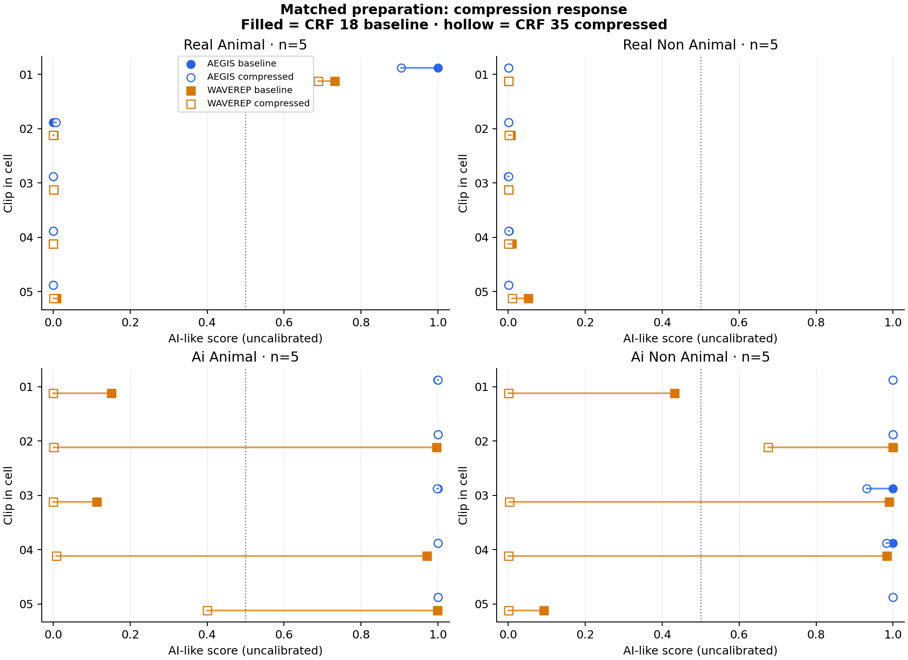

# Video Robustness

Tests how compression, resizing and cropping change pretrained AI-video detector scores.
Two models: **AEGIS** and **WaveRep**. Runs on CPU; no training required.

## Key findings

- **Compression weakened WaveRep's AI signal.** On a 20-clip panel, generated clips below 0.5 rose from **4/10 to 9/10** after stronger compression.
- **The models responded differently.** WaveRep scores changed by at least 0.10 on **9/10 generated clips**. AEGIS had **0/20** changes that large across the panel.
- **Failures started before the strongest compression.** On two selected AI clips, WaveRep crossed below 0.5 between CRF **23–28** (elephant) and **18–23** (sunset scene).



Higher scores mean more AI-like. These are small-sample results; 0.5 is a reference point, not a validated detection threshold.
[Compression results](reports/controlled/report.md) · [Intermediate compression check](reports/failure-followup/report.md)

## Run it

Requires Python 3.11 and [uv](https://docs.astral.sh/uv/).

```sh
uv sync --locked
uv run python run.py experiment configs/experiments/smoke.json
uv run python run.py check
```

The smoke run tests one real and one generated clip with both models and five conditions: **20 scores**.
First run downloads about **764 MiB of weights** and **9 MiB of clips**. Videos and weights stay out of Git.

To reproduce the 20-clip compression panel:

```sh
uv run python run.py experiment configs/experiments/compression.json
```

This adds about 263 MiB of source media and writes 80 scores, a paired chart and a report under `reports/experiments/compression/`.
Use `--dry-run` to check a config without downloading or scoring.

## How it works

A config chooses the source manifest, detectors, preparation, variants and baseline.
The shared runner verifies input hashes, prepares each variant, scores the same frames with both models,
and writes CSV scores, JSON run details and a Markdown report.

```text
config + pinned sources → prepare variants → detector adapters → paired scores + report
```

- `experiment.py`: config validation, scoring and paired analysis
- `media.py`: shared preparation and transforms
- `detectors.py` / `waverep.py`: pretrained model adapters
- `experiment_report.py`: one output format for every config

[Config guide and technical choices](docs/experiments.md) · [Methodology](docs/methodology.md) · [Earlier experiments](docs/experiment-history.md)

## Sources

[AEGIS](https://huggingface.co/MusapYildiz/aegis-video-detector) ·
[WaveRep](https://github.com/grip-unina/WaveRep-SyntheticVideoDetection) ·
[ComGenVid](https://huggingface.co/datasets/OmerXYZ/comgenvid) ·
[DAVIS via VLM4D](https://huggingface.co/datasets/shijiezhou/VLM4D)

AEGIS code retains its [MIT license](vendor/aegis/LICENSE).
WaveRep's [informational/nonprofit license](vendor/waverep/LICENSE.md) and author attribution are retained.
Dataset media are not redistributed.
