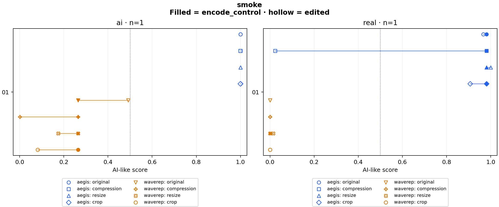

# smoke

2 clips × 5 variants × 2 detectors = 20 scores.

Baseline: **encode_control**. Preparation: `native`.

Higher scores mean more AI-like. Scores are uncalibrated; 0.5 is a fixed reference, not a validated decision threshold.

## Changes from baseline

| Detector | Variant | Group | Clips | Median change | Median absolute change | Changes ≥0.10 | Scores against label at 0.5 | Crossings |
|---|---|---|---:|---:|---:|---:|---:|---:|
| aegis | original | ai | 1 | -0.000000 | 0.000000 | 0 | 0 | 0 |
| aegis | original | real | 1 | -0.014717 | 0.014717 | 0 | 1 | 0 |
| aegis | encode_control | ai | 1 | +0.000000 | 0.000000 | 0 | 0 | 0 |
| aegis | encode_control | real | 1 | +0.000000 | 0.000000 | 0 | 1 | 0 |
| aegis | compression | ai | 1 | -0.000015 | 0.000015 | 0 | 0 | 0 |
| aegis | compression | real | 1 | -0.957334 | 0.957334 | 1 | 0 | 1 |
| aegis | resize | ai | 1 | +0.000006 | 0.000006 | 0 | 0 | 0 |
| aegis | resize | real | 1 | +0.018855 | 0.018855 | 0 | 1 | 0 |
| aegis | crop | ai | 1 | -0.000022 | 0.000022 | 0 | 0 | 0 |
| aegis | crop | real | 1 | -0.073641 | 0.073641 | 0 | 1 | 0 |
| waverep | original | ai | 1 | +0.226741 | 0.226741 | 1 | 1 | 0 |
| waverep | original | real | 1 | -0.000003 | 0.000003 | 0 | 0 | 0 |
| waverep | encode_control | ai | 1 | +0.000000 | 0.000000 | 0 | 1 | 0 |
| waverep | encode_control | real | 1 | +0.000000 | 0.000000 | 0 | 0 | 0 |
| waverep | compression | ai | 1 | -0.264246 | 0.264246 | 1 | 1 | 0 |
| waverep | compression | real | 1 | +0.000080 | 0.000080 | 0 | 0 | 0 |
| waverep | resize | ai | 1 | -0.089937 | 0.089937 | 0 | 1 | 0 |
| waverep | resize | real | 1 | +0.014651 | 0.014651 | 0 | 0 | 0 |
| waverep | crop | ai | 1 | -0.182998 | 0.182998 | 1 | 1 | 0 |
| waverep | crop | real | 1 | +0.000234 | 0.000234 | 0 | 0 | 0 |

## Scores

| Clip | Label | Detector | Variant | Score | Change |
|---|---|---|---|---:|---:|
| real_01 | real | aegis | original | 0.966411 | -0.014717 |
| real_01 | real | aegis | encode_control | 0.981128 | +0.000000 |
| real_01 | real | aegis | compression | 0.023794 | -0.957334 |
| real_01 | real | aegis | resize | 0.999983 | +0.018855 |
| real_01 | real | aegis | crop | 0.907487 | -0.073641 |
| ai_01 | ai | aegis | original | 0.999966 | -0.000000 |
| ai_01 | ai | aegis | encode_control | 0.999967 | +0.000000 |
| ai_01 | ai | aegis | compression | 0.999951 | -0.000015 |
| ai_01 | ai | aegis | resize | 0.999973 | +0.000006 |
| ai_01 | ai | aegis | crop | 0.999945 | -0.000022 |
| real_01 | real | waverep | original | 0.000151 | -0.000003 |
| real_01 | real | waverep | encode_control | 0.000154 | +0.000000 |
| real_01 | real | waverep | compression | 0.000234 | +0.000080 |
| real_01 | real | waverep | resize | 0.014805 | +0.014651 |
| real_01 | real | waverep | crop | 0.000388 | +0.000234 |
| ai_01 | ai | waverep | original | 0.491389 | +0.226741 |
| ai_01 | ai | waverep | encode_control | 0.264648 | +0.000000 |
| ai_01 | ai | waverep | compression | 0.000402 | -0.264246 |
| ai_01 | ai | waverep | resize | 0.174711 | -0.089937 |
| ai_01 | ai | waverep | crop | 0.081650 | -0.182998 |

## Run details

Every variant starts independently from the source or the common lossless master. Models receive the same decoded RGB frames, with their own native preprocessing. WaveRep averages 16 frame logits before applying sigmoid; AEGIS uses its released fusion head. Inference runs on CPU with four threads. Configs and source manifests must be committed before scoring.

These clips measure score changes, not general detector accuracy. Labels come from the dataset. Source quality and training overlap are unknown. Common preparation changes geometry and can change sampled physical frames; comparisons within the prepared variants keep those choices fixed.

Two existing discovery clips check the pipeline. They are selected for a quick run and are not new evaluation data. Resize/crop also include encoding; compare them with the encode-only control.

Reproduce: `uv run python run.py experiment configs/experiments/smoke.json`.

[Scores and logits](scores.csv) · [Summary](summary.json) · [Config, hashes and preparation commands](run.json) · [Checks](validation.json)
