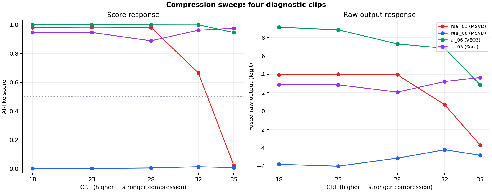
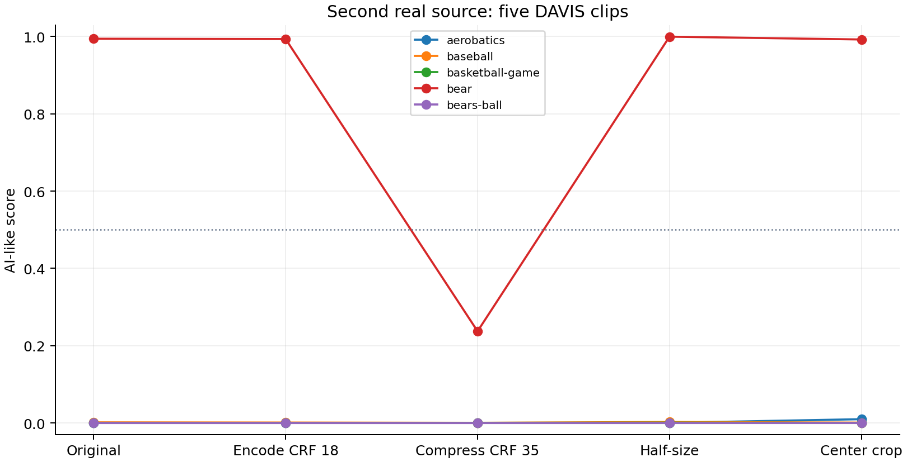

# Compression sweep and second-source check

Nine source clips, 49 scored cases. Four deliberately selected diagnostic clips use an original plus five CRF encodes. Five freshly selected DAVIS clips use the original and four standard conditions.

Selection was frozen before scoring; see [manifest](../../configs/diagnostics.json) and [policy](../../configs/diagnostics-selection.md). Diagnostic controls were chosen from prior results and are not a holdout.

## Findings

The original MSVD failure scores 0.981 at CRF 18 and 0.981 at 28, then 0.666 at 32 and 0.024 at 35. Its largest sampled step is 32–35 (-0.642); the five-point grid brackets the change without identifying an exact transition or a cause.

The second real source contains another large compression response: DAVIS `bear` scores 0.994 on the original, 0.993 on the CRF 18 control, and 0.237 at CRF 35. The other four DAVIS clips have a maximum score of 0.009962 across all five conditions. This repeats the qualitative pattern on one new source clip, not an estimate of its frequency.

The Sora diagnostic curve falls to 0.888 at CRF 28, then rises to 0.961 at 32 and 0.975 at 35. The Veo score stays high, while its fused raw output falls from 9.130 at CRF 18 to 2.849 at CRF 35. Saturated scores can hide substantial internal output changes.

## Compression curves

| Clip | Original | CRF 18 | CRF 23 | CRF 28 | CRF 32 | CRF 35 |
|---|---:|---:|---:|---:|---:|---:|
| real_01 | 0.966411 | 0.981128 | 0.982308 | 0.981176 | 0.665808 | 0.023794 |
| real_08 | 0.003090 | 0.003006 | 0.002450 | 0.005894 | 0.014502 | 0.008092 |
| ai_06 | 0.999904 | 0.999892 | 0.999857 | 0.999333 | 0.998938 | 0.945282 |
| ai_03 | 0.941124 | 0.946256 | 0.946043 | 0.887697 | 0.961432 | 0.974809 |

| Clip | Largest sampled step | Signed score change | Change per CRF unit | Midpoint crossings | Non-monotone? |
|---|---|---:|---:|---|---|
| real_01 | 32–35 | -0.642014 | -0.214005 | 32–35 | yes |
| real_08 | 28–32 | +0.008608 | +0.002152 | none | yes |
| ai_06 | 32–35 | -0.053656 | -0.017885 | none | no |
| ai_03 | 28–32 | +0.073735 | +0.018434 | none | yes |

The largest adjacent step describes where the measured change concentrates on this five-point grid. Uneven CRF spacing and non-linear encoding quality limit interpretation. A crossing of score 0.5 (raw output 0) is a descriptive midpoint, not a validated operating threshold. This coarse grid cannot locate an exact transition or identify the responsible features.

## Second real source

| Clip (DAVIS source) | Original | CRF 18 | CRF 35 | Resize | Crop | Compression − control |
|---|---:|---:|---:|---:|---:|---:|
| aerobatics | 0.000727 | 0.000391 | 0.000197 | 0.000574 | 0.009962 | -0.000195 |
| baseball | 0.001694 | 0.001255 | 0.000535 | 0.002743 | 0.001057 | -0.000719 |
| basketball-game | 0.000499 | 0.000522 | 0.000564 | 0.001021 | 0.000478 | +0.000042 |
| bear | 0.994145 | 0.993269 | 0.237462 | 0.999431 | 0.992149 | -0.755807 |
| bears-ball | 0.000036 | 0.000035 | 0.000042 | 0.000050 | 0.000088 | +0.000007 |

[VLM4D's source card](https://huggingface.co/datasets/shijiezhou/VLM4D) identifies DAVIS as real third-person footage. Its published MP4s can reflect source conversion/encoding; they are not matched in content or resolution to the MSVD failure. Dataset and clip labels are inherited, and training overlap is unknown.

## Interpretation limits

Scores are not calibrated authenticity probabilities. Raw logits expose changes hidden by saturated outputs. Pixel, motion, and consistency scores in the CSV are auxiliary trained-head outputs, not an attribution of the fused decision. Compression changes many image statistics simultaneously; curves alone cannot establish a texture/frequency mechanism. Five new real clips cannot estimate a false-positive rate or establish general robustness.

[Raw outputs and hashes](scores.csv) · [Run metadata](run.json) · [Validation](validation.json) · [Curve metrics](curve-summary.json) · [Experiment notes](experiment-log.md)

All source media remain local and are excluded from Git. Plots contain only experiment measurements, not frames.
