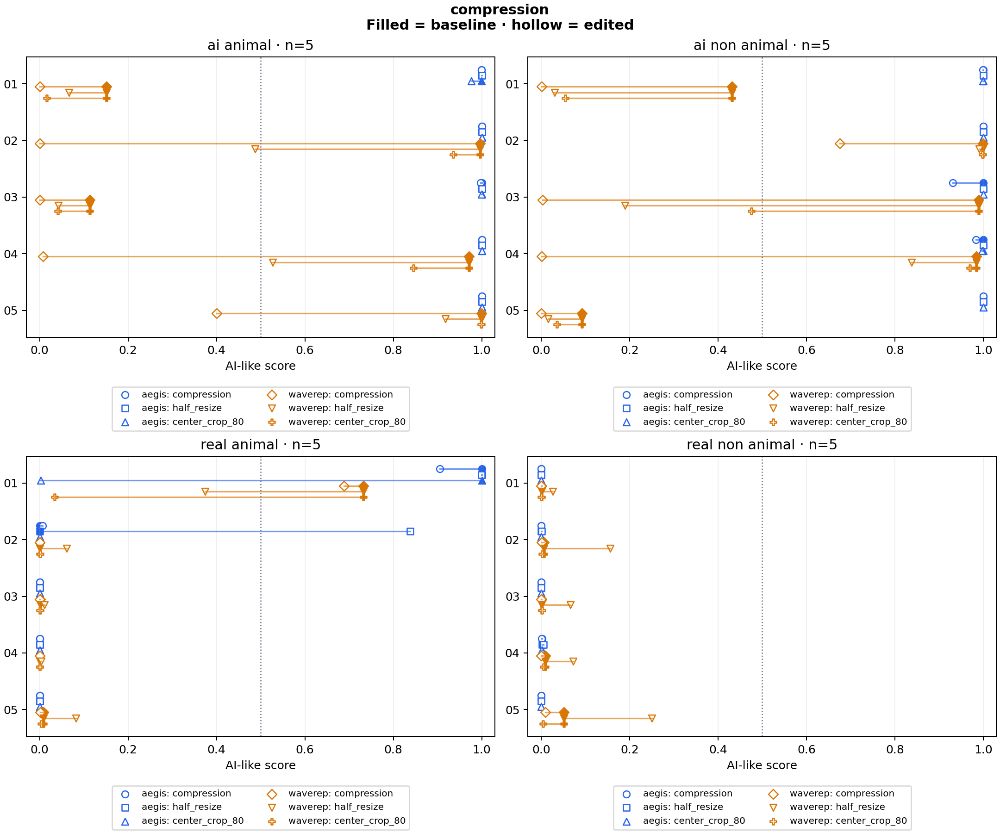

# compression

20 clips × 4 variants × 2 detectors = 160 scores.

Baseline: **baseline**. Preparation: `centered_4s_504_24fps`.

Higher scores mean more AI-like. Scores are uncalibrated; 0.5 is a fixed reference, not a validated decision threshold.

## Changes from baseline

| Detector | Variant | Group | Clips | Median change | Median absolute change | Changes ≥0.10 | Scores against label at 0.5 | Crossings |
|---|---|---|---:|---:|---:|---:|---:|---:|
| aegis | baseline | ai_animal | 5 | +0.000000 | 0.000000 | 0 | 0 | 0 |
| aegis | baseline | ai_non_animal | 5 | +0.000000 | 0.000000 | 0 | 0 | 0 |
| aegis | baseline | real_animal | 5 | +0.000000 | 0.000000 | 0 | 1 | 0 |
| aegis | baseline | real_non_animal | 5 | +0.000000 | 0.000000 | 0 | 0 | 0 |
| aegis | compression | ai_animal | 5 | -0.000000 | 0.000005 | 0 | 0 | 0 |
| aegis | compression | ai_non_animal | 5 | -0.000606 | 0.000606 | 0 | 0 | 0 |
| aegis | compression | real_animal | 5 | -0.000002 | 0.000371 | 0 | 1 | 0 |
| aegis | compression | real_non_animal | 5 | -0.000092 | 0.000092 | 0 | 0 | 0 |
| aegis | half_resize | ai_animal | 5 | +0.000014 | 0.000014 | 0 | 0 | 0 |
| aegis | half_resize | ai_non_animal | 5 | +0.000079 | 0.000079 | 0 | 0 | 0 |
| aegis | half_resize | real_animal | 5 | +0.000071 | 0.000094 | 1 | 2 | 1 |
| aegis | half_resize | real_non_animal | 5 | +0.000188 | 0.000188 | 0 | 0 | 0 |
| aegis | center_crop_80 | ai_animal | 5 | -0.000010 | 0.000010 | 0 | 0 | 0 |
| aegis | center_crop_80 | ai_non_animal | 5 | -0.000149 | 0.000149 | 0 | 0 | 0 |
| aegis | center_crop_80 | real_animal | 5 | -0.000127 | 0.000127 | 1 | 0 | 1 |
| aegis | center_crop_80 | real_non_animal | 5 | -0.000043 | 0.000043 | 0 | 0 | 0 |
| waverep | baseline | ai_animal | 5 | +0.000000 | 0.000000 | 0 | 2 | 0 |
| waverep | baseline | ai_non_animal | 5 | +0.000000 | 0.000000 | 0 | 2 | 0 |
| waverep | baseline | real_animal | 5 | +0.000000 | 0.000000 | 0 | 1 | 0 |
| waverep | baseline | real_non_animal | 5 | +0.000000 | 0.000000 | 0 | 0 | 0 |
| waverep | compression | ai_animal | 5 | -0.598130 | 0.598130 | 5 | 5 | 3 |
| waverep | compression | ai_non_animal | 5 | -0.431239 | 0.431239 | 4 | 4 | 2 |
| waverep | compression | real_animal | 5 | -0.000443 | 0.000443 | 0 | 1 | 0 |
| waverep | compression | real_non_animal | 5 | -0.005177 | 0.005177 | 0 | 0 | 0 |
| waverep | half_resize | ai_animal | 5 | -0.085307 | 0.085307 | 2 | 3 | 1 |
| waverep | half_resize | ai_non_animal | 5 | -0.145781 | 0.145781 | 3 | 3 | 1 |
| waverep | half_resize | real_animal | 5 | +0.009707 | 0.061082 | 1 | 0 | 1 |
| waverep | half_resize | real_non_animal | 5 | +0.065389 | 0.065389 | 2 | 0 | 0 |
| waverep | center_crop_80 | ai_animal | 5 | -0.071677 | 0.071677 | 2 | 2 | 0 |
| waverep | center_crop_80 | ai_non_animal | 5 | -0.056768 | 0.056768 | 2 | 3 | 1 |
| waverep | center_crop_80 | real_animal | 5 | -0.000396 | 0.000461 | 1 | 0 | 1 |
| waverep | center_crop_80 | real_non_animal | 5 | -0.003612 | 0.003612 | 0 | 0 | 0 |

## Scores

| Clip | Label | Detector | Variant | Score | Change |
|---|---|---|---|---:|---:|
| controlled_ai_animal_01 | ai | aegis | baseline | 0.999464 | +0.000000 |
| controlled_ai_animal_01 | ai | aegis | compression | 0.999620 | +0.000156 |
| controlled_ai_animal_01 | ai | aegis | half_resize | 0.999995 | +0.000531 |
| controlled_ai_animal_01 | ai | aegis | center_crop_80 | 0.976553 | -0.022911 |
| controlled_ai_animal_02 | ai | aegis | baseline | 0.999982 | +0.000000 |
| controlled_ai_animal_02 | ai | aegis | compression | 0.999985 | +0.000003 |
| controlled_ai_animal_02 | ai | aegis | half_resize | 1.000000 | +0.000018 |
| controlled_ai_animal_02 | ai | aegis | center_crop_80 | 0.999987 | +0.000005 |
| controlled_ai_animal_03 | ai | aegis | baseline | 0.999962 | +0.000000 |
| controlled_ai_animal_03 | ai | aegis | compression | 0.997467 | -0.002496 |
| controlled_ai_animal_03 | ai | aegis | half_resize | 0.999976 | +0.000014 |
| controlled_ai_animal_03 | ai | aegis | center_crop_80 | 0.999893 | -0.000069 |
| controlled_ai_animal_04 | ai | aegis | baseline | 0.999999 | +0.000000 |
| controlled_ai_animal_04 | ai | aegis | compression | 0.999998 | -0.000000 |
| controlled_ai_animal_04 | ai | aegis | half_resize | 0.999999 | +0.000000 |
| controlled_ai_animal_04 | ai | aegis | center_crop_80 | 0.999988 | -0.000010 |
| controlled_ai_animal_05 | ai | aegis | baseline | 0.999999 | +0.000000 |
| controlled_ai_animal_05 | ai | aegis | compression | 0.999994 | -0.000005 |
| controlled_ai_animal_05 | ai | aegis | half_resize | 0.999999 | +0.000000 |
| controlled_ai_animal_05 | ai | aegis | center_crop_80 | 0.999993 | -0.000006 |
| controlled_ai_non_animal_01 | ai | aegis | baseline | 0.999886 | +0.000000 |
| controlled_ai_non_animal_01 | ai | aegis | compression | 0.999280 | -0.000606 |
| controlled_ai_non_animal_01 | ai | aegis | half_resize | 0.999976 | +0.000090 |
| controlled_ai_non_animal_01 | ai | aegis | center_crop_80 | 0.999495 | -0.000392 |
| controlled_ai_non_animal_02 | ai | aegis | baseline | 0.999938 | +0.000000 |
| controlled_ai_non_animal_02 | ai | aegis | compression | 0.999651 | -0.000287 |
| controlled_ai_non_animal_02 | ai | aegis | half_resize | 0.999968 | +0.000031 |
| controlled_ai_non_animal_02 | ai | aegis | center_crop_80 | 0.999876 | -0.000062 |
| controlled_ai_non_animal_03 | ai | aegis | baseline | 0.999909 | +0.000000 |
| controlled_ai_non_animal_03 | ai | aegis | compression | 0.931091 | -0.068818 |
| controlled_ai_non_animal_03 | ai | aegis | half_resize | 0.999988 | +0.000079 |
| controlled_ai_non_animal_03 | ai | aegis | center_crop_80 | 0.999760 | -0.000149 |
| controlled_ai_non_animal_04 | ai | aegis | baseline | 0.999884 | +0.000000 |
| controlled_ai_non_animal_04 | ai | aegis | compression | 0.983481 | -0.016402 |
| controlled_ai_non_animal_04 | ai | aegis | half_resize | 0.999990 | +0.000106 |
| controlled_ai_non_animal_04 | ai | aegis | center_crop_80 | 0.997517 | -0.002366 |
| controlled_ai_non_animal_05 | ai | aegis | baseline | 0.999997 | +0.000000 |
| controlled_ai_non_animal_05 | ai | aegis | compression | 0.999996 | -0.000001 |
| controlled_ai_non_animal_05 | ai | aegis | half_resize | 0.999999 | +0.000002 |
| controlled_ai_non_animal_05 | ai | aegis | center_crop_80 | 0.999966 | -0.000031 |
| controlled_real_animal_01 | real | aegis | baseline | 0.999967 | +0.000000 |
| controlled_real_animal_01 | real | aegis | compression | 0.904924 | -0.095043 |
| controlled_real_animal_01 | real | aegis | half_resize | 0.999873 | -0.000094 |
| controlled_real_animal_01 | real | aegis | center_crop_80 | 0.002365 | -0.997602 |
| controlled_real_animal_02 | real | aegis | baseline | 0.000507 | +0.000000 |
| controlled_real_animal_02 | real | aegis | compression | 0.006549 | +0.006042 |
| controlled_real_animal_02 | real | aegis | half_resize | 0.838585 | +0.838078 |
| controlled_real_animal_02 | real | aegis | center_crop_80 | 0.000379 | -0.000127 |
| controlled_real_animal_03 | real | aegis | baseline | 0.000094 | +0.000000 |
| controlled_real_animal_03 | real | aegis | compression | 0.000092 | -0.000002 |
| controlled_real_animal_03 | real | aegis | half_resize | 0.000824 | +0.000730 |
| controlled_real_animal_03 | real | aegis | center_crop_80 | 0.000111 | +0.000017 |
| controlled_real_animal_04 | real | aegis | baseline | 0.000034 | +0.000000 |
| controlled_real_animal_04 | real | aegis | compression | 0.000038 | +0.000004 |
| controlled_real_animal_04 | real | aegis | half_resize | 0.000105 | +0.000071 |
| controlled_real_animal_04 | real | aegis | center_crop_80 | 0.000059 | +0.000025 |
| controlled_real_animal_05 | real | aegis | baseline | 0.000501 | +0.000000 |
| controlled_real_animal_05 | real | aegis | compression | 0.000130 | -0.000371 |
| controlled_real_animal_05 | real | aegis | half_resize | 0.000443 | -0.000059 |
| controlled_real_animal_05 | real | aegis | center_crop_80 | 0.000222 | -0.000280 |
| controlled_real_non_animal_01 | real | aegis | baseline | 0.000182 | +0.000000 |
| controlled_real_non_animal_01 | real | aegis | compression | 0.000090 | -0.000092 |
| controlled_real_non_animal_01 | real | aegis | half_resize | 0.000327 | +0.000145 |
| controlled_real_non_animal_01 | real | aegis | center_crop_80 | 0.000139 | -0.000043 |
| controlled_real_non_animal_02 | real | aegis | baseline | 0.000548 | +0.000000 |
| controlled_real_non_animal_02 | real | aegis | compression | 0.000133 | -0.000415 |
| controlled_real_non_animal_02 | real | aegis | half_resize | 0.001036 | +0.000488 |
| controlled_real_non_animal_02 | real | aegis | center_crop_80 | 0.000106 | -0.000442 |
| controlled_real_non_animal_03 | real | aegis | baseline | 0.000044 | +0.000000 |
| controlled_real_non_animal_03 | real | aegis | compression | 0.000085 | +0.000041 |
| controlled_real_non_animal_03 | real | aegis | half_resize | 0.000174 | +0.000130 |
| controlled_real_non_animal_03 | real | aegis | center_crop_80 | 0.000052 | +0.000008 |
| controlled_real_non_animal_04 | real | aegis | baseline | 0.002146 | +0.000000 |
| controlled_real_non_animal_04 | real | aegis | compression | 0.000784 | -0.001362 |
| controlled_real_non_animal_04 | real | aegis | half_resize | 0.005458 | +0.003312 |
| controlled_real_non_animal_04 | real | aegis | center_crop_80 | 0.001484 | -0.000662 |
| controlled_real_non_animal_05 | real | aegis | baseline | 0.000175 | +0.000000 |
| controlled_real_non_animal_05 | real | aegis | compression | 0.000200 | +0.000025 |
| controlled_real_non_animal_05 | real | aegis | half_resize | 0.000363 | +0.000188 |
| controlled_real_non_animal_05 | real | aegis | center_crop_80 | 0.000215 | +0.000040 |
| controlled_ai_animal_01 | ai | waverep | baseline | 0.151260 | +0.000000 |
| controlled_ai_animal_01 | ai | waverep | compression | 0.000174 | -0.151086 |
| controlled_ai_animal_01 | ai | waverep | half_resize | 0.065953 | -0.085307 |
| controlled_ai_animal_01 | ai | waverep | center_crop_80 | 0.015917 | -0.135343 |
| controlled_ai_animal_02 | ai | waverep | baseline | 0.996280 | +0.000000 |
| controlled_ai_animal_02 | ai | waverep | compression | 0.000879 | -0.995401 |
| controlled_ai_animal_02 | ai | waverep | half_resize | 0.487566 | -0.508714 |
| controlled_ai_animal_02 | ai | waverep | center_crop_80 | 0.935716 | -0.060564 |
| controlled_ai_animal_03 | ai | waverep | baseline | 0.113080 | +0.000000 |
| controlled_ai_animal_03 | ai | waverep | compression | 0.000288 | -0.112792 |
| controlled_ai_animal_03 | ai | waverep | half_resize | 0.042858 | -0.070222 |
| controlled_ai_animal_03 | ai | waverep | center_crop_80 | 0.041403 | -0.071677 |
| controlled_ai_animal_04 | ai | waverep | baseline | 0.971400 | +0.000000 |
| controlled_ai_animal_04 | ai | waverep | compression | 0.007834 | -0.963566 |
| controlled_ai_animal_04 | ai | waverep | half_resize | 0.527057 | -0.444343 |
| controlled_ai_animal_04 | ai | waverep | center_crop_80 | 0.845472 | -0.125928 |
| controlled_ai_animal_05 | ai | waverep | baseline | 0.998909 | +0.000000 |
| controlled_ai_animal_05 | ai | waverep | compression | 0.400779 | -0.598130 |
| controlled_ai_animal_05 | ai | waverep | half_resize | 0.917994 | -0.080915 |
| controlled_ai_animal_05 | ai | waverep | center_crop_80 | 0.998474 | -0.000435 |
| controlled_ai_non_animal_01 | ai | waverep | baseline | 0.432082 | +0.000000 |
| controlled_ai_non_animal_01 | ai | waverep | compression | 0.000843 | -0.431239 |
| controlled_ai_non_animal_01 | ai | waverep | half_resize | 0.030905 | -0.401176 |
| controlled_ai_non_animal_01 | ai | waverep | center_crop_80 | 0.054864 | -0.377218 |
| controlled_ai_non_animal_02 | ai | waverep | baseline | 0.999582 | +0.000000 |
| controlled_ai_non_animal_02 | ai | waverep | compression | 0.675879 | -0.323702 |
| controlled_ai_non_animal_02 | ai | waverep | half_resize | 0.990548 | -0.009034 |
| controlled_ai_non_animal_02 | ai | waverep | center_crop_80 | 0.998505 | -0.001076 |
| controlled_ai_non_animal_03 | ai | waverep | baseline | 0.989897 | +0.000000 |
| controlled_ai_non_animal_03 | ai | waverep | compression | 0.002951 | -0.986946 |
| controlled_ai_non_animal_03 | ai | waverep | half_resize | 0.190008 | -0.799889 |
| controlled_ai_non_animal_03 | ai | waverep | center_crop_80 | 0.475689 | -0.514208 |
| controlled_ai_non_animal_04 | ai | waverep | baseline | 0.983940 | +0.000000 |
| controlled_ai_non_animal_04 | ai | waverep | compression | 0.000974 | -0.982967 |
| controlled_ai_non_animal_04 | ai | waverep | half_resize | 0.838160 | -0.145781 |
| controlled_ai_non_animal_04 | ai | waverep | center_crop_80 | 0.970244 | -0.013696 |
| controlled_ai_non_animal_05 | ai | waverep | baseline | 0.092674 | +0.000000 |
| controlled_ai_non_animal_05 | ai | waverep | compression | 0.000168 | -0.092506 |
| controlled_ai_non_animal_05 | ai | waverep | half_resize | 0.015399 | -0.077274 |
| controlled_ai_non_animal_05 | ai | waverep | center_crop_80 | 0.035905 | -0.056768 |
| controlled_real_animal_01 | real | waverep | baseline | 0.732082 | +0.000000 |
| controlled_real_animal_01 | real | waverep | compression | 0.688378 | -0.043705 |
| controlled_real_animal_01 | real | waverep | half_resize | 0.374155 | -0.357928 |
| controlled_real_animal_01 | real | waverep | center_crop_80 | 0.033672 | -0.698411 |
| controlled_real_animal_02 | real | waverep | baseline | 0.000581 | +0.000000 |
| controlled_real_animal_02 | real | waverep | compression | 0.000323 | -0.000258 |
| controlled_real_animal_02 | real | waverep | half_resize | 0.061663 | +0.061082 |
| controlled_real_animal_02 | real | waverep | center_crop_80 | 0.001042 | +0.000461 |
| controlled_real_animal_03 | real | waverep | baseline | 0.001034 | +0.000000 |
| controlled_real_animal_03 | real | waverep | compression | 0.000591 | -0.000443 |
| controlled_real_animal_03 | real | waverep | half_resize | 0.010741 | +0.009707 |
| controlled_real_animal_03 | real | waverep | center_crop_80 | 0.000638 | -0.000396 |
| controlled_real_animal_04 | real | waverep | baseline | 0.000123 | +0.000000 |
| controlled_real_animal_04 | real | waverep | compression | 0.000102 | -0.000021 |
| controlled_real_animal_04 | real | waverep | half_resize | 0.003866 | +0.003742 |
| controlled_real_animal_04 | real | waverep | center_crop_80 | 0.000129 | +0.000006 |
| controlled_real_animal_05 | real | waverep | baseline | 0.008413 | +0.000000 |
| controlled_real_animal_05 | real | waverep | compression | 0.001460 | -0.006954 |
| controlled_real_animal_05 | real | waverep | half_resize | 0.082353 | +0.073939 |
| controlled_real_animal_05 | real | waverep | center_crop_80 | 0.003363 | -0.005050 |
| controlled_real_non_animal_01 | real | waverep | baseline | 0.000859 | +0.000000 |
| controlled_real_non_animal_01 | real | waverep | compression | 0.000108 | -0.000751 |
| controlled_real_non_animal_01 | real | waverep | half_resize | 0.025899 | +0.025040 |
| controlled_real_non_animal_01 | real | waverep | center_crop_80 | 0.000445 | -0.000415 |
| controlled_real_non_animal_02 | real | waverep | baseline | 0.006569 | +0.000000 |
| controlled_real_non_animal_02 | real | waverep | compression | 0.001391 | -0.005177 |
| controlled_real_non_animal_02 | real | waverep | half_resize | 0.156310 | +0.149741 |
| controlled_real_non_animal_02 | real | waverep | center_crop_80 | 0.002052 | -0.004516 |
| controlled_real_non_animal_03 | real | waverep | baseline | 0.001167 | +0.000000 |
| controlled_real_non_animal_03 | real | waverep | compression | 0.000140 | -0.001028 |
| controlled_real_non_animal_03 | real | waverep | half_resize | 0.066556 | +0.065389 |
| controlled_real_non_animal_03 | real | waverep | center_crop_80 | 0.001785 | +0.000618 |
| controlled_real_non_animal_04 | real | waverep | baseline | 0.009175 | +0.000000 |
| controlled_real_non_animal_04 | real | waverep | compression | 0.000246 | -0.008930 |
| controlled_real_non_animal_04 | real | waverep | half_resize | 0.072069 | +0.062894 |
| controlled_real_non_animal_04 | real | waverep | center_crop_80 | 0.005563 | -0.003612 |
| controlled_real_non_animal_05 | real | waverep | baseline | 0.051373 | +0.000000 |
| controlled_real_non_animal_05 | real | waverep | compression | 0.009657 | -0.041715 |
| controlled_real_non_animal_05 | real | waverep | half_resize | 0.250167 | +0.198795 |
| controlled_real_non_animal_05 | real | waverep | center_crop_80 | 0.004025 | -0.047348 |

## Run details

Every variant starts independently from the source or the common lossless master. Models receive the same decoded RGB frames, with their own native preprocessing. Inference runs on CPU with four threads. Configs and source manifests must be committed before scoring.

These clips measure score changes, not general detector accuracy. Labels come from the dataset. Source quality and training overlap are unknown. Common preparation changes geometry and can change sampled physical frames; comparisons within the prepared variants keep those choices fixed.

| Adapter | Native preprocessing and aggregation |
|---|---|
| aegis | 16 RGB frames; linear resize to 224×224; ImageNet normalization; released fusion head |
| waverep | 16 RGB frames; 504×504 center crop with zero padding for smaller inputs; ImageNet normalization; sigmoid of mean frame logits; batch size 2 |

20 previously selected clips, five per real/AI × animal/non-animal group. The source manifest and content audit are unchanged. All four variants start independently from the same 504×504 lossless master. Baseline, resize and crop use H.264 CRF 18; compression uses CRF 35. Resize produces 252×252 pixels and crop produces 402×402 pixels. WaveRep zero-pads these to 504×504; that padding is part of the measured pipeline response. The added edits are follow-ups on an existing panel, not a new holdout.

Reproduce: `uv run python run.py experiment configs/experiments/compression.json`.

[Scores and logits](scores.csv) · [Summary](summary.json) · [Config, hashes and preparation commands](run.json) · [Checks](validation.json)
