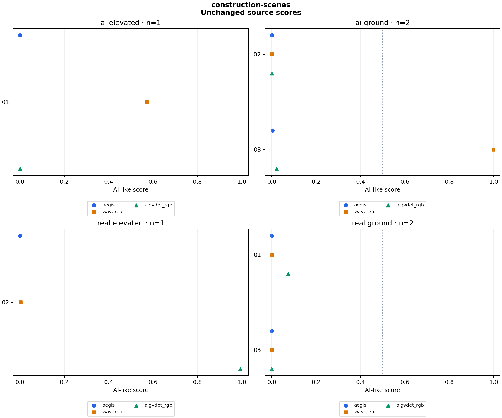

# construction-scenes

6 clips × 1 variants × 3 detectors = 18 scores.

Baseline: **original**. Preparation: `native`.

Higher scores mean more AI-like. Scores are uncalibrated; 0.5 is a fixed reference, not a validated decision threshold.

## Both error directions

| Variant | Detector | Real scored AI-like / real clips | AI scored real-like / AI clips |
|---|---|---:|---:|
| original | aegis | 0/3 | 3/3 |
| original | waverep | 0/3 | 1/3 |
| original | aigvdet_rgb | 1/3 | 3/3 |

## When models agree

All scores ≥0.5: AI-like. All scores <0.5: real-like. Mixed sides: inconclusive. This fixed rule measures a coverage/error tradeoff; agreement does not establish authenticity.

| Variant | Agreed clips / all | Correct agreed | Real scored AI-like | AI scored real-like | Inconclusive |
|---|---:|---:|---:|---:|---:|
| original | 3/6 | 2 | 0 | 1 | 3 |

Inconclusive clips stay in the denominator; they are not counted as correct predictions. Inspect per-source counts below because source and content can affect these totals.

## Changes from baseline

| Detector | Variant | Group | Clips | Median change | Median absolute change | Changes ≥0.10 | Scores against label at 0.5 | Crossings |
|---|---|---|---:|---:|---:|---:|---:|---:|
| aegis | original | ai_elevated | 1 | +0.000000 | 0.000000 | 0 | 1 | 0 |
| aegis | original | ai_ground | 2 | +0.000000 | 0.000000 | 0 | 2 | 0 |
| aegis | original | real_elevated | 1 | +0.000000 | 0.000000 | 0 | 0 | 0 |
| aegis | original | real_ground | 2 | +0.000000 | 0.000000 | 0 | 0 | 0 |
| waverep | original | ai_elevated | 1 | +0.000000 | 0.000000 | 0 | 0 | 0 |
| waverep | original | ai_ground | 2 | +0.000000 | 0.000000 | 0 | 1 | 0 |
| waverep | original | real_elevated | 1 | +0.000000 | 0.000000 | 0 | 0 | 0 |
| waverep | original | real_ground | 2 | +0.000000 | 0.000000 | 0 | 0 | 0 |
| aigvdet_rgb | original | ai_elevated | 1 | +0.000000 | 0.000000 | 0 | 1 | 0 |
| aigvdet_rgb | original | ai_ground | 2 | +0.000000 | 0.000000 | 0 | 2 | 0 |
| aigvdet_rgb | original | real_elevated | 1 | +0.000000 | 0.000000 | 0 | 1 | 0 |
| aigvdet_rgb | original | real_ground | 2 | +0.000000 | 0.000000 | 0 | 0 | 0 |

## Scores

| Clip | Label | Detector | Variant | Score | Change |
|---|---|---|---|---:|---:|
| construction_real_01 | real | aegis | original | 0.000064 | +0.000000 |
| construction_real_02 | real | aegis | original | 0.000085 | +0.000000 |
| construction_ai_01 | ai | aegis | original | 0.000319 | +0.000000 |
| construction_ai_02 | ai | aegis | original | 0.001518 | +0.000000 |
| construction_ai_03 | ai | aegis | original | 0.004372 | +0.000000 |
| construction_real_03 | real | aegis | original | 0.000172 | +0.000000 |
| construction_real_01 | real | waverep | original | 0.002716 | +0.000000 |
| construction_real_02 | real | waverep | original | 0.002710 | +0.000000 |
| construction_ai_01 | ai | waverep | original | 0.573257 | +0.000000 |
| construction_ai_02 | ai | waverep | original | 0.001390 | +0.000000 |
| construction_ai_03 | ai | waverep | original | 0.999419 | +0.000000 |
| construction_real_03 | real | waverep | original | 0.000210 | +0.000000 |
| construction_real_01 | real | aigvdet_rgb | original | 0.074717 | +0.000000 |
| construction_real_02 | real | aigvdet_rgb | original | 0.992684 | +0.000000 |
| construction_ai_01 | ai | aigvdet_rgb | original | 0.000000 | +0.000000 |
| construction_ai_02 | ai | aigvdet_rgb | original | 0.000000 | +0.000000 |
| construction_ai_03 | ai | aigvdet_rgb | original | 0.021749 | +0.000000 |
| construction_real_03 | real | aigvdet_rgb | original | 0.000000 | +0.000000 |

## Run details

Every variant starts independently from the source or the common lossless master. Models receive the same decoded RGB frames, with their own native preprocessing. Inference runs on CPU with four threads. Configs and source manifests must be committed before scoring.

These clips measure score changes, not general detector accuracy. Labels come from the dataset. Source quality and training overlap are unknown. Common preparation changes geometry and can change sampled physical frames; comparisons within the prepared variants keep those choices fixed.

| Adapter | Native preprocessing and aggregation |
|---|---|
| aegis | 16 RGB frames; linear resize to 224×224; ImageNet normalization; released fusion head |
| waverep | 16 RGB frames; 504×504 center crop with zero padding for smaller inputs; ImageNet normalization; sigmoid of mean frame logits; batch size 2 |
| aigvdet_rgb | RGB branch only; 16 RGB frames; 448×448 center crop (zero padding if smaller); ImageNet normalization; mean frame sigmoid probabilities; batch size 1 |

Six new source clips, three real and three generated, broadly matched on daylight crane/construction subject matter and ground/elevated viewpoint counts (two ground and one elevated per origin). Real clips are dated 2015, 2019 and 2022 from two creators; generated clips are two Sora 2 Pro and one Veo 3.1 via SynthSite. These are coarse content/viewpoint groups, not exact scene pairs. Sources, codecs, resolutions, framing and durations still differ; model center crops can exclude cranes and workers. Original file bytes and native preprocessing are retained. See configs/construction-scenes-selection.md; fixed descriptive 0.5 reference, no calibration or model changes. RGB-only/sparse-frame AIGVDet and sparse-frame WaveRep adaptations remain. No deployment change follows from this pilot.

Reproduce: `uv run python run.py experiment configs/experiments/construction-scenes.json`.

[Scores and logits](scores.csv) · [Summary](summary.json) · [Errors and agreement](decisions.json) · [Config, hashes and preparation commands](run.json) · [Checks](validation.json)
