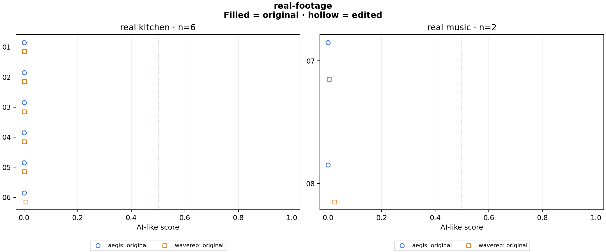

# real-footage

8 clips × 1 variants × 2 detectors = 16 scores.

Baseline: **original**. Preparation: `native`.

Higher scores mean more AI-like. Scores are uncalibrated; 0.5 is a fixed reference, not a validated decision threshold.

## Changes from baseline

| Detector | Variant | Group | Clips | Median change | Median absolute change | Changes ≥0.10 | Scores against label at 0.5 | Crossings |
|---|---|---|---:|---:|---:|---:|---:|---:|
| aegis | original | real_kitchen | 6 | +0.000000 | 0.000000 | 0 | 0 | 0 |
| aegis | original | real_music | 2 | +0.000000 | 0.000000 | 0 | 0 | 0 |
| waverep | original | real_kitchen | 6 | +0.000000 | 0.000000 | 0 | 0 | 0 |
| waverep | original | real_music | 2 | +0.000000 | 0.000000 | 0 | 0 | 0 |

## Scores

| Clip | Label | Detector | Variant | Score | Change |
|---|---|---|---|---:|---:|
| real_check_01 | real | aegis | original | 0.000032 | +0.000000 |
| real_check_02 | real | aegis | original | 0.000051 | +0.000000 |
| real_check_03 | real | aegis | original | 0.000031 | +0.000000 |
| real_check_04 | real | aegis | original | 0.000062 | +0.000000 |
| real_check_05 | real | aegis | original | 0.000100 | +0.000000 |
| real_check_06 | real | aegis | original | 0.000021 | +0.000000 |
| real_check_07 | real | aegis | original | 0.000125 | +0.000000 |
| real_check_08 | real | aegis | original | 0.000143 | +0.000000 |
| real_check_01 | real | waverep | original | 0.001542 | +0.000000 |
| real_check_02 | real | waverep | original | 0.001536 | +0.000000 |
| real_check_03 | real | waverep | original | 0.000320 | +0.000000 |
| real_check_04 | real | waverep | original | 0.000157 | +0.000000 |
| real_check_05 | real | waverep | original | 0.000151 | +0.000000 |
| real_check_06 | real | waverep | original | 0.006322 | +0.000000 |
| real_check_07 | real | waverep | original | 0.004674 | +0.000000 |
| real_check_08 | real | waverep | original | 0.025213 | +0.000000 |

## Run details

Every variant starts independently from the source or the common lossless master. Models receive the same decoded RGB frames, with their own native preprocessing. Inference runs on CPU with four threads. Configs and source manifests must be committed before scoring.

These clips measure score changes, not general detector accuracy. Labels come from the dataset. Source quality and training overlap are unknown. Common preparation changes geometry and can change sampled physical frames; comparisons within the prepared variants keep those choices fixed.

| Adapter | Native preprocessing and aggregation |
|---|---|
| aegis | 16 RGB frames; linear resize to 224×224; ImageNet normalization; released fusion head |
| waverep | 16 RGB frames; 504×504 center crop with zero padding for smaller inputs; ImageNet normalization; sigmoid of mean frame logits; batch size 2 |

Eight real-only clips selected before inference: six kitchen actions, two music performances. Original source bytes are scored without added edits. See configs/real-footage-selection.md; this targeted panel cannot estimate general accuracy or AI recall.

Reproduce: `uv run python run.py experiment configs/experiments/real-footage.json`.

[Scores and logits](scores.csv) · [Summary](summary.json) · [Config, hashes and preparation commands](run.json) · [Checks](validation.json)
