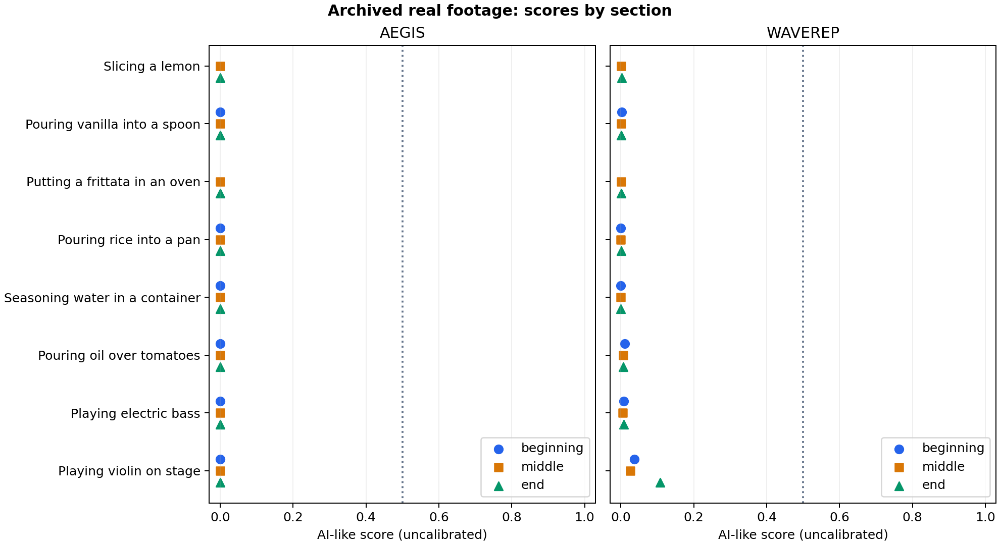

# real-footage: real footage by section

8 archived real clips; 22 distinct sampled windows per detector. Each model receives the same 16 RGB frames in each window.

| Detector | Group | Clips | Middle ≥0.5 | Any section ≥0.5 | Windows ≥0.5 / sampled |
|---|---|---:|---:|---:|---:|
| aegis | all | 8 | 0 | 0 | 0/22 |
| aegis | real_kitchen | 6 | 0 | 0 | 0/16 |
| aegis | real_music | 2 | 0 | 0 | 0/6 |
| waverep | all | 8 | 0 | 0 | 0/22 |
| waverep | real_kitchen | 6 | 0 | 0 | 0/16 |
| waverep | real_music | 2 | 0 | 0 | 0/6 |

0.5 is an uncalibrated reference midpoint. A high score conflicts with the real source label; it does not establish that a video is AI-generated. Any-section counts give more opportunities for a high score than middle-only counts.

## Every score

| Clip | Content | Section | Sampled seconds | aegis | waverep |
|---|---|---|---|---:|---:|
| real_check_01 | Slicing a lemon | middle | 0.00–3.92 | 0.000032 | 0.001542 |
| real_check_01 | Slicing a lemon | end | 0.04–3.96 | 0.000031 | 0.002008 |
| real_check_02 | Pouring vanilla into a spoon | beginning | 0.00–3.94 | 0.000038 | 0.001965 |
| real_check_02 | Pouring vanilla into a spoon | middle | 0.50–4.44 | 0.000051 | 0.001536 |
| real_check_02 | Pouring vanilla into a spoon | end | 1.03–4.97 | 0.000073 | 0.001421 |
| real_check_03 | Putting a frittata in an oven | middle | 0.00–3.94 | 0.000031 | 0.000320 |
| real_check_03 | Putting a frittata in an oven | end | 0.03–3.97 | 0.000030 | 0.000384 |
| real_check_04 | Pouring rice into a pan | beginning | 0.00–3.94 | 0.000065 | 0.000174 |
| real_check_04 | Pouring rice into a pan | middle | 0.50–4.44 | 0.000062 | 0.000157 |
| real_check_04 | Pouring rice into a pan | end | 1.03–4.97 | 0.000080 | 0.000218 |
| real_check_05 | Seasoning water in a container | beginning | 0.00–3.94 | 0.000098 | 0.000195 |
| real_check_05 | Seasoning water in a container | middle | 1.00–4.94 | 0.000100 | 0.000151 |
| real_check_05 | Seasoning water in a container | end | 2.04–5.97 | 0.000053 | 0.000166 |
| real_check_06 | Pouring oil over tomatoes | beginning | 0.00–3.94 | 0.000006 | 0.010383 |
| real_check_06 | Pouring oil over tomatoes | middle | 0.50–4.44 | 0.000021 | 0.006322 |
| real_check_06 | Pouring oil over tomatoes | end | 1.03–4.97 | 0.000024 | 0.005838 |
| real_check_07 | Playing electric bass | beginning | 0.00–3.96 | 0.000118 | 0.007145 |
| real_check_07 | Playing electric bass | middle | 2.50–6.46 | 0.000125 | 0.004674 |
| real_check_07 | Playing electric bass | end | 5.04–9.00 | 0.000100 | 0.007379 |
| real_check_08 | Playing violin on stage | beginning | 0.00–3.94 | 0.000098 | 0.036815 |
| real_check_08 | Playing violin on stage | middle | 2.51–6.45 | 0.000143 | 0.025213 |
| real_check_08 | Playing violin on stage | end | 5.05–8.99 | 0.000040 | 0.108054 |

## What this test establishes

Source dataset: `OmerXYZ/comgenvid`. Selection and source labels were fixed before inference. Eight real-only clips selected before inference: six kitchen actions, two music performances. Original source bytes are scored without added edits. See configs/real-footage-selection.md; this targeted panel cannot estimate general accuracy or AI recall.

[Frozen source manifest](../../../configs/real-footage.json) · [Selection policy](../../../configs/real-footage-selection.md)

Source bytes are unchanged. No resizing, cropping or re-encoding is added by this check; each detector still uses its own native preprocessing. All shortest sides are at least 504 pixels, so WaveRep adds no padding. WaveRep evaluates only its central 504×504 region with 16 frames, rather than the upstream full-video evaluation.

Beginning/middle/end windows can overlap on clips shorter than 12 seconds. Identical windows are deduplicated. These are not independent videos or a population false-positive rate. A real-only panel cannot measure AI-detection recall or identify the better model overall. Training overlap, source quality and the exact visual trigger remain unknown.

Checks passed: full source decodes, source/checkpoint hashes, identical RGB inputs between models, and exact middle-window score/logit/input-hash reproduction against the config runner. The models and thresholds were not changed.

Reproduce: `uv run python scripts/check_sections.py configs/experiments/real-footage.json`.

[Raw section scores and hashes](sections.json) · [CSV](sections.csv) · [Runtime provenance](run.json)
