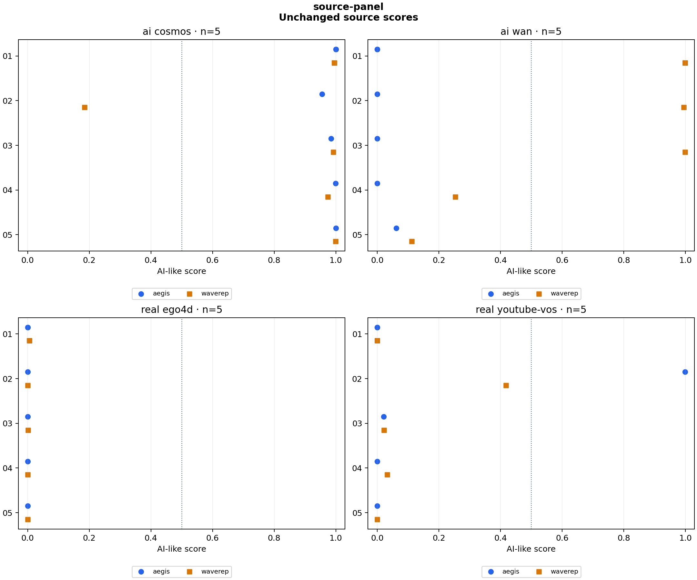

# source-panel

20 clips × 1 variants × 2 detectors = 40 scores.

Baseline: **original**. Preparation: `native`.

Higher scores mean more AI-like. Scores are uncalibrated; 0.5 is a fixed reference, not a validated decision threshold.

## Both error directions

| Variant | Detector | Real scored AI-like / real clips | AI scored real-like / AI clips |
|---|---|---:|---:|
| original | aegis | 1/10 | 5/10 |
| original | waverep | 0/10 | 3/10 |

## When models agree

All scores ≥0.5: AI-like. All scores <0.5: real-like. Mixed sides: inconclusive. This fixed rule measures a coverage/error tradeoff; agreement does not establish authenticity.

| Variant | Agreed clips / all | Correct agreed | Real scored AI-like | AI scored real-like | Inconclusive |
|---|---:|---:|---:|---:|---:|
| original | 15/20 | 13 | 0 | 2 | 5 |

Inconclusive clips stay in the denominator; they are not counted as correct predictions. Inspect per-source counts below because source and content can affect these totals.

## Changes from baseline

| Detector | Variant | Group | Clips | Median change | Median absolute change | Changes ≥0.10 | Scores against label at 0.5 | Crossings |
|---|---|---|---:|---:|---:|---:|---:|---:|
| aegis | original | ai_cosmos | 5 | +0.000000 | 0.000000 | 0 | 0 | 0 |
| aegis | original | ai_wan | 5 | +0.000000 | 0.000000 | 0 | 5 | 0 |
| aegis | original | real_ego4d | 5 | +0.000000 | 0.000000 | 0 | 0 | 0 |
| aegis | original | real_youtube-vos | 5 | +0.000000 | 0.000000 | 0 | 1 | 0 |
| waverep | original | ai_cosmos | 5 | +0.000000 | 0.000000 | 0 | 1 | 0 |
| waverep | original | ai_wan | 5 | +0.000000 | 0.000000 | 0 | 2 | 0 |
| waverep | original | real_ego4d | 5 | +0.000000 | 0.000000 | 0 | 0 | 0 |
| waverep | original | real_youtube-vos | 5 | +0.000000 | 0.000000 | 0 | 0 | 0 |

## Scores

| Clip | Label | Detector | Variant | Score | Change |
|---|---|---|---|---:|---:|
| panel_ego4d_01 | real | aegis | original | 0.000021 | +0.000000 |
| panel_ego4d_02 | real | aegis | original | 0.000019 | +0.000000 |
| panel_ego4d_03 | real | aegis | original | 0.000060 | +0.000000 |
| panel_ego4d_04 | real | aegis | original | 0.000036 | +0.000000 |
| panel_ego4d_05 | real | aegis | original | 0.000052 | +0.000000 |
| panel_youtube_vos_01 | real | aegis | original | 0.000056 | +0.000000 |
| panel_youtube_vos_02 | real | aegis | original | 0.999404 | +0.000000 |
| panel_youtube_vos_03 | real | aegis | original | 0.021333 | +0.000000 |
| panel_youtube_vos_04 | real | aegis | original | 0.000227 | +0.000000 |
| panel_youtube_vos_05 | real | aegis | original | 0.000125 | +0.000000 |
| panel_cosmos_01 | ai | aegis | original | 0.999998 | +0.000000 |
| panel_cosmos_02 | ai | aegis | original | 0.955374 | +0.000000 |
| panel_cosmos_03 | ai | aegis | original | 0.985207 | +0.000000 |
| panel_cosmos_04 | ai | aegis | original | 0.999903 | +0.000000 |
| panel_cosmos_05 | ai | aegis | original | 0.999996 | +0.000000 |
| panel_wan_01 | ai | aegis | original | 0.000134 | +0.000000 |
| panel_wan_02 | ai | aegis | original | 0.000177 | +0.000000 |
| panel_wan_03 | ai | aegis | original | 0.000177 | +0.000000 |
| panel_wan_04 | ai | aegis | original | 0.000104 | +0.000000 |
| panel_wan_05 | ai | aegis | original | 0.061691 | +0.000000 |
| panel_ego4d_01 | real | waverep | original | 0.005246 | +0.000000 |
| panel_ego4d_02 | real | waverep | original | 0.000318 | +0.000000 |
| panel_ego4d_03 | real | waverep | original | 0.001248 | +0.000000 |
| panel_ego4d_04 | real | waverep | original | 0.000201 | +0.000000 |
| panel_ego4d_05 | real | waverep | original | 0.000185 | +0.000000 |
| panel_youtube_vos_01 | real | waverep | original | 0.000162 | +0.000000 |
| panel_youtube_vos_02 | real | waverep | original | 0.417487 | +0.000000 |
| panel_youtube_vos_03 | real | waverep | original | 0.022558 | +0.000000 |
| panel_youtube_vos_04 | real | waverep | original | 0.032242 | +0.000000 |
| panel_youtube_vos_05 | real | waverep | original | 0.000312 | +0.000000 |
| panel_cosmos_01 | ai | waverep | original | 0.994797 | +0.000000 |
| panel_cosmos_02 | ai | waverep | original | 0.184541 | +0.000000 |
| panel_cosmos_03 | ai | waverep | original | 0.992048 | +0.000000 |
| panel_cosmos_04 | ai | waverep | original | 0.974761 | +0.000000 |
| panel_cosmos_05 | ai | waverep | original | 0.999313 | +0.000000 |
| panel_wan_01 | ai | waverep | original | 0.998650 | +0.000000 |
| panel_wan_02 | ai | waverep | original | 0.994744 | +0.000000 |
| panel_wan_03 | ai | waverep | original | 0.999226 | +0.000000 |
| panel_wan_04 | ai | waverep | original | 0.253087 | +0.000000 |
| panel_wan_05 | ai | waverep | original | 0.111852 | +0.000000 |

## Run details

Every variant starts independently from the source or the common lossless master. Models receive the same decoded RGB frames, with their own native preprocessing. Inference runs on CPU with four threads. Configs and source manifests must be committed before scoring.

These clips measure score changes, not general detector accuracy. Labels come from the dataset. Source quality and training overlap are unknown. Common preparation changes geometry and can change sampled physical frames; comparisons within the prepared variants keep those choices fixed.

| Adapter | Native preprocessing and aggregation |
|---|---|
| aegis | 16 RGB frames; linear resize to 224×224; ImageNet normalization; released fusion head |
| waverep | 16 RGB frames; 504×504 center crop with zero padding for smaller inputs; ImageNet normalization; sigmoid of mean frame logits; batch size 2 |

Twenty newly scored clips: five real Ego4D, five real YouTube-VOS, five generated Cosmos, five generated Wan 2.2-14B. Source labels and generator attribution follow the dataset author cards. See configs/source-panel-selection.md. Source, content, encoding and viewpoint differ across groups; native sampling uses nominal constant-fps timing. Five Ego4D clips show two room setups, and three Wan clips share a construction scene. Counts describe this convenience pilot, not independent trials or population accuracy. Checkpoint training overlap is unknown. No calibration, threshold tuning or deployment change is made.

Reproduce: `uv run python run.py experiment configs/experiments/source-panel.json`.

[Scores and logits](scores.csv) · [Summary](summary.json) · [Errors and agreement](decisions.json) · [Config, hashes and preparation commands](run.json) · [Checks](validation.json)
