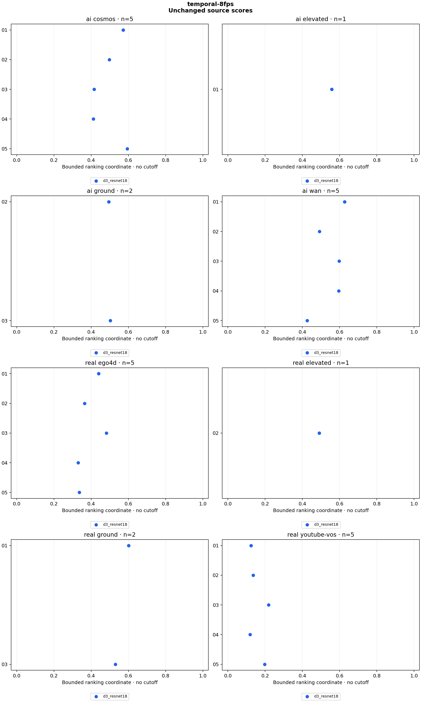

# temporal-8fps

26 clips, 26 scores. Sampling: `centered_2s_8fps`.

Higher ranking coordinates mean more AI-like within each detector. There is no decision cutoff, probability, error-rate claim or model-agreement verdict. AUC counts AI/real pair orderings, with ties worth half. Source clusters and repeated scenes make pairs dependent; these counts are descriptive.

| Detector | Variant | AI clips | Real clips | AI above real pairs | Tied pairs | Pairs | AUC |
|---|---|---:|---:|---:|---:|---:|---:|
| d3_resnet18 | original | 13 | 13 | 141 | 0 | 169 | 0.834320 |

## Raw scores

| Clip | Label | Detector | Variant | Raw temporal std (higher = real-like) | Bounded ranking coordinate |
|---|---|---|---|---:|---:|
| panel_ego4d_01 | real | d3_resnet18 | original | 1.271604 | 0.440218 |
| panel_ego4d_02 | real | d3_resnet18 | original | 1.739950 | 0.364970 |
| panel_ego4d_03 | real | d3_resnet18 | original | 1.073910 | 0.482181 |
| panel_ego4d_04 | real | d3_resnet18 | original | 2.026254 | 0.330442 |
| panel_ego4d_05 | real | d3_resnet18 | original | 1.966647 | 0.337081 |
| panel_youtube_vos_01 | real | d3_resnet18 | original | 6.989196 | 0.125169 |
| panel_youtube_vos_02 | real | d3_resnet18 | original | 6.333734 | 0.136356 |
| panel_youtube_vos_03 | real | d3_resnet18 | original | 3.555826 | 0.219499 |
| panel_youtube_vos_04 | real | d3_resnet18 | original | 7.396770 | 0.119093 |
| panel_youtube_vos_05 | real | d3_resnet18 | original | 4.056467 | 0.197767 |
| panel_cosmos_01 | ai | d3_resnet18 | original | 0.747473 | 0.572255 |
| panel_cosmos_02 | ai | d3_resnet18 | original | 1.010134 | 0.497479 |
| panel_cosmos_03 | ai | d3_resnet18 | original | 1.399859 | 0.416691 |
| panel_cosmos_04 | ai | d3_resnet18 | original | 1.425328 | 0.412315 |
| panel_cosmos_05 | ai | d3_resnet18 | original | 0.682530 | 0.594343 |
| panel_wan_01 | ai | d3_resnet18 | original | 0.593979 | 0.627361 |
| panel_wan_02 | ai | d3_resnet18 | original | 1.029581 | 0.492713 |
| panel_wan_03 | ai | d3_resnet18 | original | 0.673063 | 0.597706 |
| panel_wan_04 | ai | d3_resnet18 | original | 0.678358 | 0.595820 |
| panel_wan_05 | ai | d3_resnet18 | original | 1.342866 | 0.426828 |
| construction_real_01 | real | d3_resnet18 | original | 0.663102 | 0.601286 |
| construction_real_02 | real | d3_resnet18 | original | 1.036344 | 0.491076 |
| construction_ai_01 | ai | d3_resnet18 | original | 0.790516 | 0.558498 |
| construction_ai_02 | ai | d3_resnet18 | original | 1.022395 | 0.494463 |
| construction_ai_03 | ai | d3_resnet18 | original | 0.985889 | 0.503553 |
| construction_real_03 | real | d3_resnet18 | original | 0.885505 | 0.530362 |

## Method

**d3_resnet18:** Author BGR order; trim 10% from each end of long axis; OpenCV linear 224×224 resize; ImageNet normalization; ResNet18 pooled features; sample std of second differences of L2 frame-feature distances; lower discrepancy is more AI-like. ai_score=1/(1+temporal_std) is a bounded ranking coordinate, never a probability or midpoint decision.

D3 ResNet18 option, L2 discrepancy; ranking only. All 26 previously published source files are retained. The bounded ai_score coordinate is 1/(1+raw temporal_std), with no decision threshold or calibration. Author BGR preprocessing is preserved. This is an adaptation to deterministic center-window sampling and directly decoded source frames: upstream uses random-window 8 fps JPEG frames, and its main model is XCLIP, not this lightweight option. The 8 fps profile checks native-like timing without introducing JPEG encoding. See configs/temporal-ranking-policy.md. Counts do not measure general accuracy or establish a replacement for the demo.

Reproduce: `uv run python run.py experiment configs/experiments/temporal-8fps.json`.

[Scores and temporal distances](scores.csv) · [Rank counts](summary.json) · [Provenance](run.json) · [Checks](validation.json)
