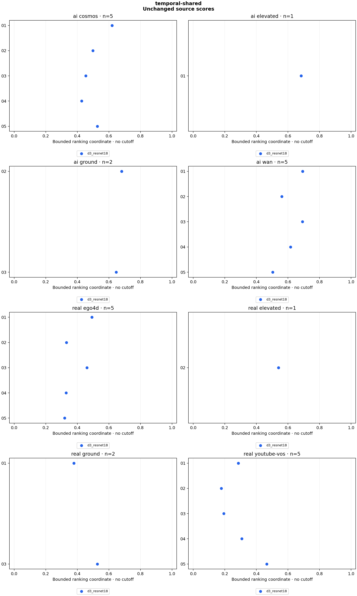

# temporal-shared

26 clips, 26 scores. Sampling: `centered_4s_16`.

Higher ranking coordinates mean more AI-like within each detector. There is no decision cutoff, probability, error-rate claim or model-agreement verdict. AUC counts AI/real pair orderings, with ties worth half. Source clusters and repeated scenes make pairs dependent; these counts are descriptive.

| Detector | Variant | AI clips | Real clips | AI above real pairs | Tied pairs | Pairs | AUC |
|---|---|---:|---:|---:|---:|---:|---:|
| d3_resnet18 | original | 13 | 13 | 154 | 0 | 169 | 0.911243 |

## Raw scores

| Clip | Label | Detector | Variant | Raw temporal std (higher = real-like) | Bounded ranking coordinate |
|---|---|---|---|---:|---:|
| panel_ego4d_01 | real | d3_resnet18 | original | 1.027952 | 0.493108 |
| panel_ego4d_02 | real | d3_resnet18 | original | 2.017496 | 0.331401 |
| panel_ego4d_03 | real | d3_resnet18 | original | 1.169913 | 0.460848 |
| panel_ego4d_04 | real | d3_resnet18 | original | 2.033261 | 0.329678 |
| panel_ego4d_05 | real | d3_resnet18 | original | 2.125375 | 0.319962 |
| panel_youtube_vos_01 | real | d3_resnet18 | original | 2.501832 | 0.285565 |
| panel_youtube_vos_02 | real | d3_resnet18 | original | 4.615184 | 0.178089 |
| panel_youtube_vos_03 | real | d3_resnet18 | original | 4.146279 | 0.194315 |
| panel_youtube_vos_04 | real | d3_resnet18 | original | 2.242863 | 0.308370 |
| panel_youtube_vos_05 | real | d3_resnet18 | original | 1.144183 | 0.466378 |
| panel_cosmos_01 | ai | d3_resnet18 | original | 0.612182 | 0.620277 |
| panel_cosmos_02 | ai | d3_resnet18 | original | 1.002809 | 0.499299 |
| panel_cosmos_03 | ai | d3_resnet18 | original | 1.200806 | 0.454379 |
| panel_cosmos_04 | ai | d3_resnet18 | original | 1.339352 | 0.427469 |
| panel_cosmos_05 | ai | d3_resnet18 | original | 0.897817 | 0.526921 |
| panel_wan_01 | ai | d3_resnet18 | original | 0.442524 | 0.693229 |
| panel_wan_02 | ai | d3_resnet18 | original | 0.779864 | 0.561841 |
| panel_wan_03 | ai | d3_resnet18 | original | 0.443619 | 0.692704 |
| panel_wan_04 | ai | d3_resnet18 | original | 0.621714 | 0.616631 |
| panel_wan_05 | ai | d3_resnet18 | original | 0.984461 | 0.503915 |
| construction_real_01 | real | d3_resnet18 | original | 1.638956 | 0.378938 |
| construction_real_02 | real | d3_resnet18 | original | 0.848568 | 0.540959 |
| construction_ai_01 | ai | d3_resnet18 | original | 0.461279 | 0.684332 |
| construction_ai_02 | ai | d3_resnet18 | original | 0.469000 | 0.680735 |
| construction_ai_03 | ai | d3_resnet18 | original | 0.547264 | 0.646302 |
| construction_real_03 | real | d3_resnet18 | original | 0.898396 | 0.526761 |

## Method

**d3_resnet18:** Author BGR order; trim 10% from each end of long axis; OpenCV linear 224×224 resize; ImageNet normalization; ResNet18 pooled features; sample std of second differences of L2 frame-feature distances; lower discrepancy is more AI-like. ai_score=1/(1+temporal_std) is a bounded ranking coordinate, never a probability or midpoint decision.

D3 ResNet18 option, L2 discrepancy; ranking only. All 26 previously published source files are retained. The bounded ai_score coordinate is 1/(1+raw temporal_std), with no decision threshold or calibration. Author BGR preprocessing is preserved. This is an adaptation to deterministic center-window sampling and directly decoded source frames: upstream uses random-window 8 fps JPEG frames, and its main model is XCLIP, not this lightweight option. The 8 fps profile checks native-like timing without introducing JPEG encoding. See configs/temporal-ranking-policy.md. Counts do not measure general accuracy or establish a replacement for the demo.

Reproduce: `uv run python run.py experiment configs/experiments/temporal-shared.json`.

[Scores and temporal distances](scores.csv) · [Rank counts](summary.json) · [Provenance](run.json) · [Checks](validation.json)
