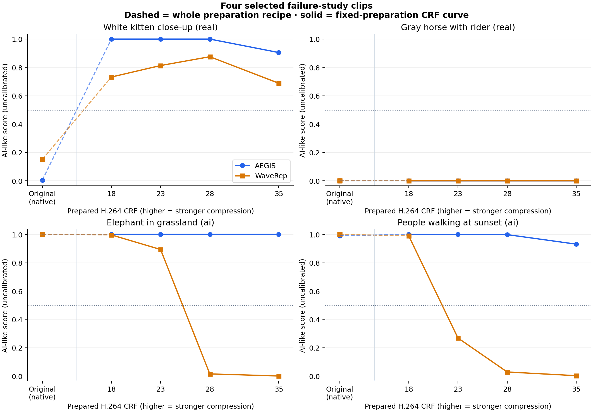

# Four-clip failure follow-up

Four existing, deliberately selected clips; 40 model-score rows. The original-file check tests whether the observed failures already occur before common preparation. CRF 23 and 28 add two intermediate compression strengths to the prepared CRF 18/35 endpoints.

## Findings

- **White kitten close-up (real):** original → prepared baseline is 0.005296 → 0.999967 for AEGIS and 0.151378 → 0.732082 for WaveRep.
- **Gray horse with rider (real):** original → prepared baseline is 0.000028 → 0.000034 for AEGIS and 0.000067 → 0.000123 for WaveRep.
- **Elephant in grassland (ai):** original → prepared baseline is 0.999984 → 0.999982 for AEGIS and 0.999724 → 0.996280 for WaveRep.
  WaveRep prepared-curve midpoint crossings: CRF 23 → 28 (change -0.877968).
- **People walking at sunset (ai):** original → prepared baseline is 0.990610 → 0.999909 for AEGIS and 0.999711 → 0.989897 for WaveRep.
  WaveRep prepared-curve midpoint crossings: CRF 18 → 23 (change -0.721062).

A midpoint crossing is descriptive; scores are not calibrated probabilities. The crossing occurs somewhere between tested settings, and this small grid cannot locate its exact CRF. If the original and baseline differ, the comparison combines cropping/scaling, frame-rate conversion, window rounding/frame selection and encoding. It cannot identify a single cause.

## All scores

| Clip | Model | Original | Prepared CRF 18 | CRF 23 | CRF 28 | CRF 35 |
|---|---|---:|---:|---:|---:|---:|
| White kitten close-up (real) | aegis | 0.005296 | 0.999967 | 0.999949 | 0.999943 | 0.904924 |
| White kitten close-up (real) | waverep | 0.151378 | 0.732082 | 0.813252 | 0.875519 | 0.688378 |
| Gray horse with rider (real) | aegis | 0.000028 | 0.000034 | 0.000033 | 0.000034 | 0.000038 |
| Gray horse with rider (real) | waverep | 0.000067 | 0.000123 | 0.000140 | 0.000091 | 0.000102 |
| Elephant in grassland (ai) | aegis | 0.999984 | 0.999982 | 0.999982 | 0.999982 | 0.999985 |
| Elephant in grassland (ai) | waverep | 0.999724 | 0.996280 | 0.893296 | 0.015329 | 0.000879 |
| People walking at sunset (ai) | aegis | 0.990610 | 0.999909 | 0.999793 | 0.998266 | 0.931091 |
| People walking at sunset (ai) | waverep | 0.999711 | 0.989897 | 0.268835 | 0.029022 | 0.002951 |

## Preparation and curve steps

| Clip / model | Baseline − original | Largest adjacent CRF change | Change per CRF unit | Curve direction | First tested below-midpoint CRF* |
|---|---:|---|---:|---|---:|
| White kitten close-up / aegis | +0.994671 | 28 → 35: -0.095019 | -0.013574 | decreasing | — |
| White kitten close-up / waverep | +0.580705 | 28 → 35: -0.187141 | -0.026734 | mixed | — |
| Gray horse with rider / aegis | +0.000006 | 28 → 35: +0.000004 | +0.000001 | mixed | — |
| Gray horse with rider / waverep | +0.000056 | 23 → 28: -0.000049 | -0.000010 | mixed | — |
| Elephant in grassland / aegis | -0.000003 | 28 → 35: +0.000003 | +0.000000 | increasing | — |
| Elephant in grassland / waverep | -0.003444 | 23 → 28: -0.877968 | -0.175594 | decreasing | 28 |
| People walking at sunset / aegis | +0.009298 | 28 → 35: -0.067175 | -0.009596 | decreasing | — |
| People walking at sunset / waverep | -0.009814 | 18 → 23: -0.721062 | -0.144212 | decreasing | 23 |

*Only when CRF 18 starts at or above 0.5. All crossings and all adjacent steps, including positive and negative changes, are retained in [summary.json](summary.json). Directions ignore changes ≤1e-6. CRF is not a linear perceptual-quality scale.

## Choices and practical limits

- **Four targeted clips:** the shared real-kitten error, first low-scoring real horse, and the largest earlier WaveRep drops in each AI content cell. Selection used previous results; these are failure cases and a comparison clip, not a new test set or an accuracy benchmark.
- **Original files:** preserve native 1280×720 resolution and frame rate; both models use their unchanged native spatial preprocessing and the same centered 16 source-frame indices. AEGIS resizes to 224; WaveRep center-crops 504. Prepared variants use 504×504, 24 fps, 96 frames. Original/prepared samples need not be the same physical frames; indices and times remain in the CSV.
- **CRF 23 and 28:** two intermediate levels keep the study small while bracketing large endpoint drops. Each level is encoded independently from the same lossless prepared master with medium preset, yuv420p and no audio. Each master is checked against its parent hash. Endpoints are reused only when hashes, sampled indices, model/preprocessing provenance and package versions agree; otherwise they are rescored and marked in the CSV.
- **Unchanged pretrained inference:** CPU, four threads, seed 0, deterministic algorithms, WaveRep batches of two frames. Strict checkpoints and native aggregation stay unchanged. Full sequential decodes and paired bytes/indices are checked. Raw logits, AEGIS auxiliary heads and all WaveRep frame logits are retained so saturation can be examined.
- **Fresh-model repeats:** reload both models for the kitten original and the newly tested midpoint bracket of each AI curve. If there is no such bracket, repeat CRF 23. Every score, logit, auxiliary output and frame index must match exactly; see [validation.json](validation.json).
- **Interpretation:** the horse shares native size/FPS with the kitten but differs in species, motion, texture and camera history. Original-to-prepared differences do not isolate one transformation. The midpoint is not calibrated; source labels are inherited and possible training overlap is unknown. Four selected clips cannot establish a causal animal effect, population robustness or detector ranking. WaveRep remains a sparse-frame adaptation.

## Reproduce

`uv sync --locked` then `uv run python run.py followup`. The command fetches the four pinned sources and checkpoints if missing, prepares independent encodes, verifies reusable endpoints, scores new cases, reloads both models for repeats, and regenerates this chart/report. No new dataset or dependency is required. Earlier reports stay unchanged.

[Frozen selection](../../configs/failure-followup-selection.md) · [Manifest](../../configs/failure-followup.json) · [Scores, branch outputs and sampling](scores.csv) · [Run and commands](run.json) · [Validation](validation.json) · [Parent balanced panel](../controlled/report.md)

Only numerical results and measurement charts are published. Videos, source frames, masters and weights stay local. WaveRep retains its [authors and informational/nonprofit license](../../vendor/waverep/ORIGIN.md).
