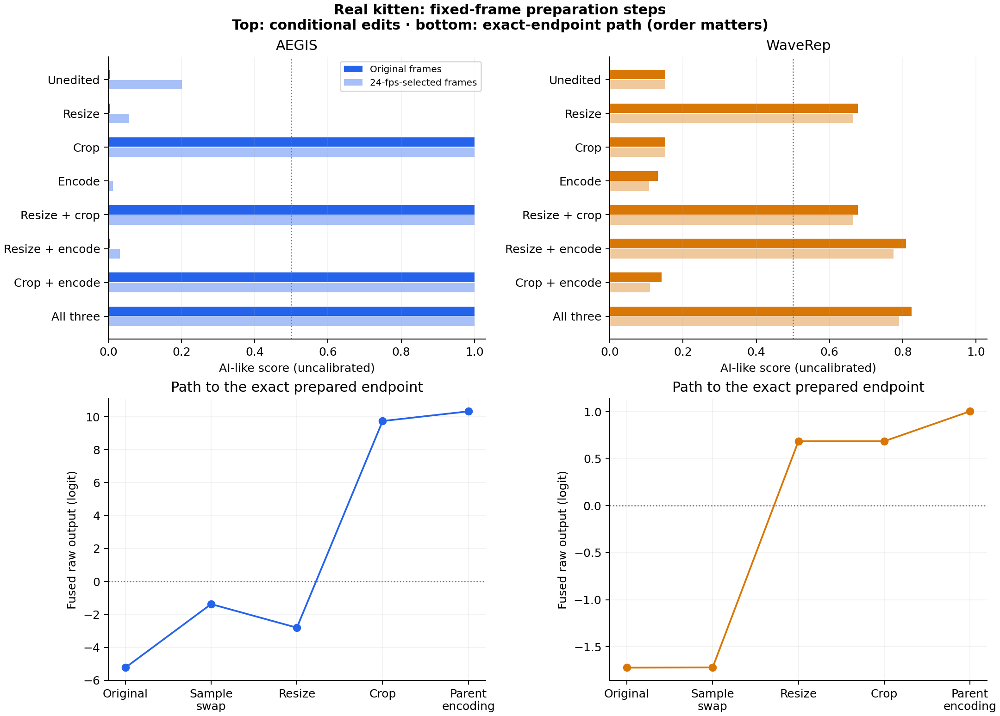

# Which preparation steps change the real kitten score?

One previously observed clip; 36 model scores. Spatial/encoding interventions use fixed source frames. The alternate frame list is traced from the exact prior 24-fps conversion. Original and actual prepared endpoints must reproduce the published outputs exactly.

## Findings

- **aegis:** fixed original-frame reference 0.005296; resize 0.005971, crop 0.999898, encode 0.002927. Edits sufficient alone to move above the descriptive midpoint in this setting: crop.
  Changing only the sampled frame list gives 0.201662; changing only FPS metadata gives 0.005296.
- **waverep:** fixed original-frame reference 0.151378; resize 0.677383, crop 0.151378, encode 0.131674. Edits sufficient alone to move above the descriptive midpoint in this setting: resize.
  Changing only the sampled frame list gives 0.151628; changing only FPS metadata gives 0.151378.

These are conditional effects on this clip and these input pipelines. A sufficient edit does not reveal a learned biological/texture mechanism, prove a unique cause, or establish population accuracy. The exact original-to-prepared path below retains possible interactions and the final encoding context.

## All factorial scores

| Spatial/encoding edits | AEGIS: original frames | AEGIS: FPS-selected frames | WaveRep: original frames | WaveRep: FPS-selected frames |
|---|---:|---:|---:|---:|
| Unedited | 0.005296 | 0.201662 | 0.151378 | 0.151628 |
| Resize | 0.005971 | 0.056948 | 0.677383 | 0.665251 |
| Crop | 0.999898 | 0.999959 | 0.151378 | 0.151628 |
| Encode | 0.002927 | 0.012986 | 0.131674 | 0.107660 |
| Resize + crop | 0.999841 | 0.999941 | 0.677383 | 0.665251 |
| Resize + encode | 0.004062 | 0.032255 | 0.808246 | 0.774663 |
| Crop + encode | 0.999870 | 0.999951 | 0.140921 | 0.109734 |
| All three | 0.999881 | 0.999959 | 0.824028 | 0.789592 |

## Exact endpoint path

| Model | Step (all other inputs held fixed) | Score change | Logit change |
|---|---|---:|---:|
| aegis | Change source-frame list | +0.196366 | +3.859505 |
| aegis | Resize with alternate frames | -0.144714 | -1.431052 |
| aegis | Center crop after resize | +0.942994 | +12.546782 |
| aegis | Encode exact 96-frame/24-fps parent master | +0.000026 | +0.587524 |
| waverep | Change source-frame list | +0.000250 | +0.001947 |
| waverep | Resize with alternate frames | +0.513623 | +2.408674 |
| waverep | Center crop after resize | +0.000000 | +0.000000 |
| waverep | Encode exact 96-frame/24-fps parent master | +0.066831 | +0.318430 |

The logit changes telescope to the actual original-to-prepared difference. This is a path-dependent decomposition; changing the order or settings can change each contribution. Do not interpret these numbers as percentages of a unique global cause.

## Resize/crop interaction without H.264

| Model | Original frames: logit interaction | FPS-selected frames: logit interaction |
|---|---:|---:|
| aegis | -0.560837 | +1.063244 |
| waverep | +0.000000 | +0.000000 |

Interaction = z(resize+crop) − z(resize) − z(crop) + z(unedited), on each fixed frame set. This records non-additivity for these interventions; it is not a significance test. All conditional single-factor changes are in [summary.json](summary.json).

## Why the controls matter

- **Exact frames:** the original list and alternate 24-fps-selected list differ at nine positions. Every resize/crop/encoding pair within a list keeps the same 16 source-frame identities. The alternate list is recovered from unique YUV/plane checksum matches through the actual FPS filter, rather than approximate timestamp rounding.
- **Pixel-exact lossless reference:** native source → FFV1 yuv420p must preserve the sampled decoded RGB pixels exactly. Spatial filters use the same FFmpeg bicubic resize/center crop as the parent recipe. Width, height, all 240 decoded frames and native FPS are checked for each factorial file.
- **Native model preprocessing:** AEGIS keeps its 224-pixel resize and normalization; WaveRep keeps its 504-pixel center crop and normalization, averaging frame logits before sigmoid. Fixed-frame inference injects only the selected RGB frames; it does not change weights, preprocessing or aggregation. Both published endpoint scores, logits and branches must match exactly.
- **Frame rate:** a metadata-only file has 240 unchanged images at 24 fps and the same explicit source indices. Both models consume image tensors, not timestamps. Real FPS conversion affects which images get sampled and can change encoding context; these effects are measured separately.
- **Encoding context:** factorial H.264 conditions encode the full 240-frame native-rate sequence, holding that context fixed across spatial/encoding comparisons. The actual parent baseline encodes a different 96-frame, 24-fps sequence. Its bridge is scored directly. Lossless resized/cropped alternate-frame inputs must match the parent master pixels, permitting an exact final encoding comparison.
- **Model-input hashes:** decoded RGB and final normalized tensor hashes are retained. A crop can remove pixels that a model already ignores through its native center crop; equal tensor hashes identify such no-op conditions. Resize can change the effective field of view or scale after model preprocessing.
- **Scope:** this is a targeted one-clip experiment selected after a failure. Scores and the 0.5 midpoint are uncalibrated. Results depend on codec context, interpolation, sampled frames and intervention order. They explain a pipeline response for this clip without identifying a learned mechanism or general animal-video behavior.

## Reproduce and verify

`uv sync --locked` then `uv run python run.py isolate`. The command recreates local media, verifies exact frame/pixel bridges, runs 36 scores, reloads both models for repeats, and regenerates this report. No new dataset, model or dependency is added. Earlier reports remain unchanged.

[Frozen specification](../../configs/kitten-isolation-selection.md) · [Exact frame lists](../../configs/kitten-isolation.json) · [Every score, raw output and input hash](scores.csv) · [Run/commands](run.json) · [Validation and repeats](validation.json) · [Prior original-file follow-up](../failure-followup/report.md)

Source frames, transformed videos and weights remain local. WaveRep retains its [authors and informational/nonprofit license](../../vendor/waverep/ORIGIN.md).
