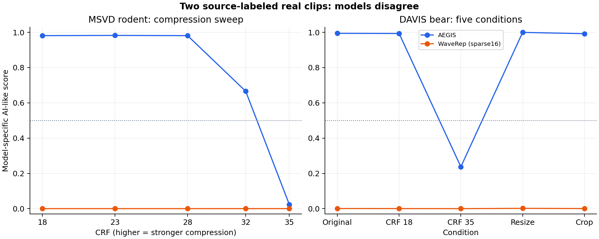
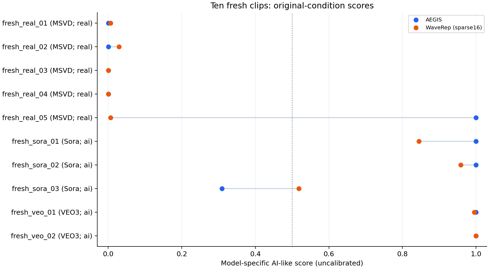

# AEGIS and WaveRep: paired robustness comparison

35 source clips: 25 previous and ten fresh. Five standard conditions plus retained compression-sweep points produce 187 paired cases (374 model scores). 137 published AEGIS cases are reused after byte/hash and provenance checks; 50 new AEGIS and all 187 WaveRep cases are scored.

[Frozen selection](../../configs/two-detectors-selection.md) · [Input manifest](../../configs/two-detectors.json)

## Findings

WaveRep gives scores above the descriptive midpoint on 0/2 known real originals that AEGIS scores highly. On the rodent, original scores are AEGIS 0.966411 and WaveRep 0.000151; on the bear they are 0.994145 and 0.000685, respectively.

On ten fresh originals, AEGIS has 1 real-label and 1 AI-label midpoint conflicts; WaveRep has 0 and 0. The models disagree across the midpoint on 2/10 originals. These are descriptive small-panel counts, not an accuracy ranking.

The fresh real panda clip (`fresh_real_05`) scores 0.999992 with AEGIS and 0.005953 with WaveRep. AEGIS remains at 0.999970 after strong compression. This adds another high-score real-animal case, but the earlier compression drop does not repeat on it. Animal content alone is not a controlled explanation.

The fresh generated coastal-road clip (`fresh_sora_03`) scores 0.309382 with AEGIS; resizing raises it to 0.980479, and cropping to 0.984834. WaveRep's original score is 0.518378, falling to 0.000858 after strong compression. The fresh panel contains both original-label conflicts and edit-sensitive decisions.

For fresh compression/resize/crop conditions, AEGIS has 2/30 changes of at least 0.10 relative to the encode-only control; WaveRep has 9/30. A correct-looking original score does not establish transformation stability.

## Known real cases

| Case | Model | Original | CRF 18 | CRF 35 | Resize | Crop | Compression − control |
|---|---|---:|---:|---:|---:|---:|---:|
| real_01 | aegis | 0.966411 | 0.981128 | 0.023794 | 0.999983 | 0.907487 | -0.957334 |
| real_01 | waverep | 0.000151 | 0.000154 | 0.000234 | 0.014805 | 0.000388 | +0.000080 |
| davis_04 | aegis | 0.994145 | 0.993269 | 0.237462 | 0.999431 | 0.992149 | -0.755807 |
| davis_04 | waverep | 0.000685 | 0.000464 | 0.000097 | 0.001752 | 0.000735 | -0.000366 |

Scores are model-specific and uncalibrated. Agreement or disagreement on these exact cases does not identify a shared learned mechanism or establish general superiority.

| Sweep clip | Model | Largest CRF step | Signed change | Midpoint crossings | Non-monotone? |
|---|---|---|---:|---|---|
| real_01 | aegis | 32–35 | -0.642014 | 32–35 | yes |
| real_01 | waverep | 32–35 | +0.000049 | none | yes |
| real_08 | aegis | 28–32 | +0.008608 | none | yes |
| real_08 | waverep | 23–28 | -0.000439 | none | yes |
| ai_06 | aegis | 32–35 | -0.053656 | none | no |
| ai_06 | waverep | 18–23 | -0.667474 | 18–23 | yes |
| ai_03 | aegis | 28–32 | +0.073735 | none | yes |
| ai_03 | waverep | 18–23 | -0.008723 | none | no |

All five sampled levels and signed steps per CRF are retained in [curve metrics](curve-summary.json). The sparse grid and CRF's non-linear quality scale limit transition interpretation.

## Fresh clips

| Clip | Source label | AEGIS original | WaveRep original | Midpoint disagreement? |
|---|---|---:|---:|---|
| fresh_real_01 | real (MSVD) | 0.000102 | 0.006612 | no |
| fresh_real_02 | real (MSVD) | 0.000052 | 0.029015 | no |
| fresh_real_03 | real (MSVD) | 0.000274 | 0.000154 | no |
| fresh_real_04 | real (MSVD) | 0.000146 | 0.000409 | no |
| fresh_real_05 | real (MSVD) | 0.999992 | 0.005953 | yes |
| fresh_sora_01 | ai (Sora) | 0.999905 | 0.844688 | no |
| fresh_sora_02 | ai (Sora) | 0.999987 | 0.958810 | no |
| fresh_sora_03 | ai (Sora) | 0.309382 | 0.518378 | yes |
| fresh_veo_01 | ai (VEO3) | 0.999981 | 0.995672 | no |
| fresh_veo_02 | ai (VEO3) | 0.999955 | 0.999840 | no |

## Descriptive summary

Conflicts use the fixed score midpoint 0.5 only; this is not an operating-threshold or false-positive-rate evaluation. Each original source contributes once. Large changes count each compression/resize/crop condition relative to CRF 18, with absolute magnitude at least 0.10; opposite signs do not cancel.

| Panel | Model | Original real conflicts | Original AI conflicts | Large paired changes |
|---|---|---:|---:|---:|
| all | aegis | 3/20 | 1/15 | 4/105 |
| all | waverep | 0/20 | 2/15 | 29/105 |
| fresh | aegis | 1/5 | 1/5 | 2/30 |
| fresh | waverep | 0/5 | 0/5 | 9/30 |

| Panel | Original model midpoint disagreements |
|---|---:|
| all | 6/35 |
| fresh | 2/10 |

## Scope and technical choices

WaveRep G4 uses released trained weights, strict full-state loading and the native 504-pixel center crop/pad plus ImageNet normalization. The native demo averages frame logits before sigmoid; this adapter retains that rule. It uses the same 16 temporal indices as AEGIS over a centered four-second window, rather than every frame as in the WaveRep demo. This keeps CPU cost manageable and controls temporal selection, but is explicitly a sparse-frame adaptation, not reproduction of the paper's evaluation.

The native spatial preprocessing differs: AEGIS resizes to 224; WaveRep crops/pads to 504. Resizing can therefore add more zero padding for WaveRep, and this experiment measures the complete input pipeline. No raw score magnitude is treated as comparable calibrated confidence. Full per-frame WaveRep logits and sampling indices are retained in the CSV.

The fresh clips are ten filename-selected cases from the existing ComGenVid dataset, not a representative or declared training holdout. Training overlap is unknown; content and source encoding differ by class. Both models use DINOv2 backbones, so they do not cover independent backbone families. Five fresh real and five fresh generated clips cannot support a low-FPR claim, a deployment recommendation, or a robust accuracy ranking. No model or threshold was trained/tuned on these clips.

## Sources and reproducibility

WaveRep: Riccardo Corvi, Davide Cozzolino, Ekta Prashnani, Shalini De Mello, Koki Nagano, Luisa Verdoliva, ‘Seeing What Matters: Generalizable AI-generated Video Detection with Forensic-Oriented Augmentation,’ NeurIPS 2025. [Official code](https://github.com/grip-unina/WaveRep-SyntheticVideoDetection), [retained license and adapter notes](../../vendor/waverep/ORIGIN.md). Informational/nonprofit research use; weights are not redistributed.

AEGIS: [published checkpoint](https://huggingface.co/MusapYildiz/aegis-video-detector). Inputs: [ComGenVid](https://huggingface.co/datasets/OmerXYZ/comgenvid), [DAVIS via VLM4D](https://huggingface.co/datasets/shijiezhou/VLM4D). Media and extracted frames remain local.

Reproduce with `uv sync --locked` then `uv run python run.py compare`. WaveRep adds a ~331 MiB checkpoint and the fresh inputs add ~42 MiB. All existing dependencies suffice. Interrupted WaveRep extraction can resume only when input, model, adapter and environment signatures match.

[All scores and frame logits](scores.csv) · [Summary JSON](summary.json) · [Run metadata](run.json) · [Validation](validation.json) · [Experiment notes](experiment-log.md)
